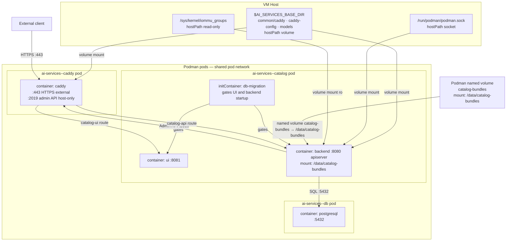
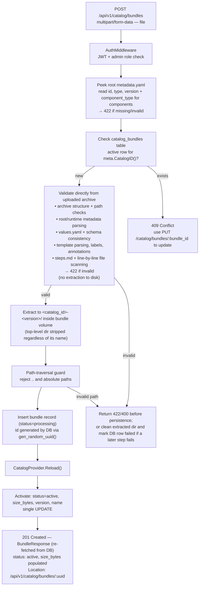
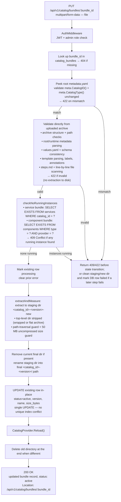
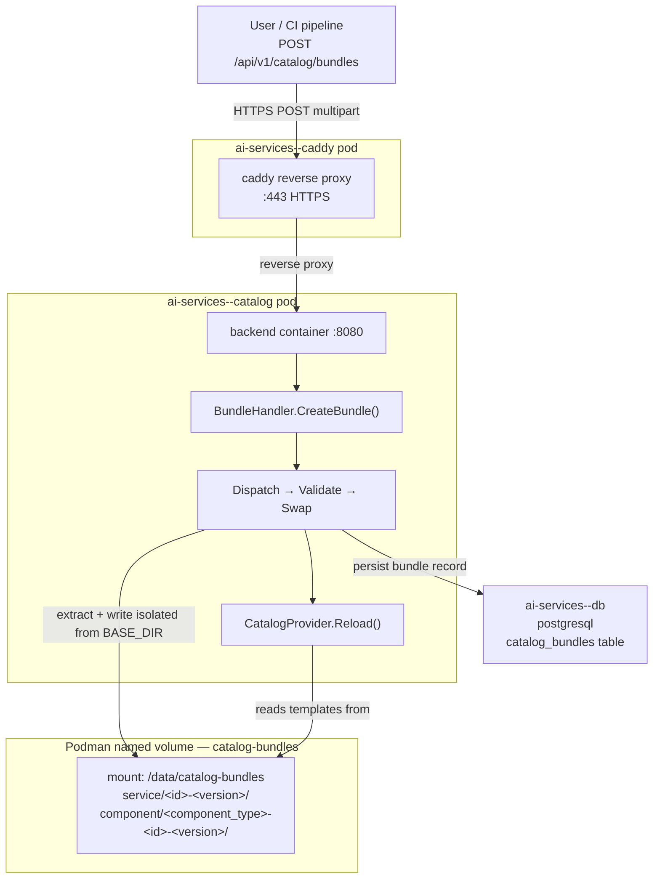
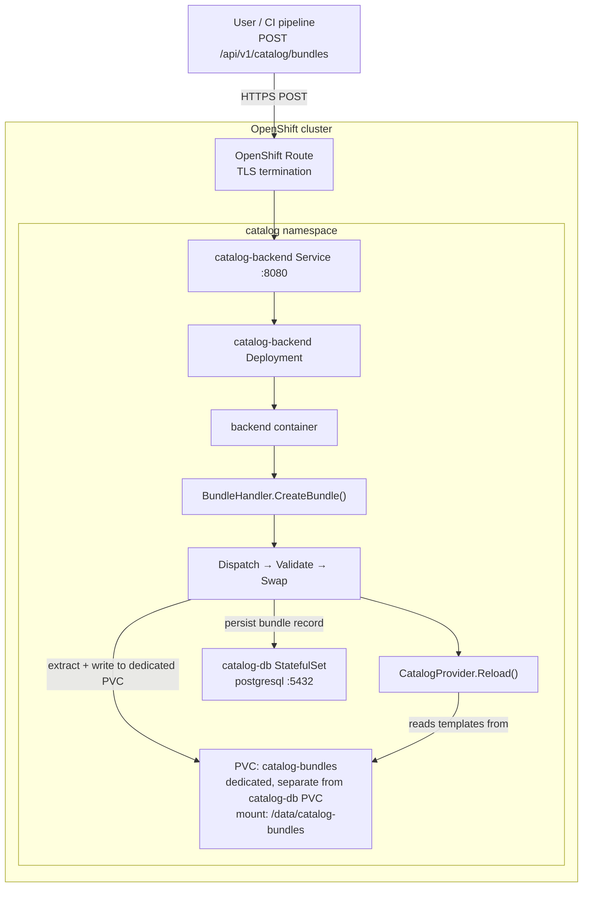

# Custom Service Templates for Customer Asset Onboarding

**Version:** 1.0
**Date:** Aug 2026
**Status:** Draft

---

## Table of Contents

1. [Executive Summary](#1-executive-summary)
2. [Background and Motivation](#2-background-and-motivation)
3. [Catalog Pod Architecture](#3-catalog-pod-architecture)
4. [New Asset Structure](#4-new-asset-structure)
    - 4.1 [Built-in service assets (existing)](#41-built-in-service-assets-existing)
    - 4.2 [Architecture assets (existing)](#42-architecture-assets-existing)
    - 4.3 [Custom service assets (proposed)](#43-custom-service-assets-proposed)
    - 4.4 [Custom component assets (proposed)](#44-custom-component-assets-proposed)
5. [CatalogProvider Integration](#5-catalogprovider-integration)
6. [API Create Bundle](#6-api-create-bundle)
    - 6.1 [Design goals](#61-design-goals)
    - 6.2 [New API endpoints](#62-new-api-endpoints)
    - 6.3 [Bundle format](#63-bundle-format)
    - 6.4 [Server-side processing pipeline](#64-server-side-processing-pipeline)
    - 6.5 [New database migration](#65-new-database-migration)
    - 6.6 [Storage per runtime](#66-storage-per-runtime)
    - 6.7 [Create Bundle flow diagrams](#67-create-bundle-flow-diagrams)
    - 6.8 [Handler and service (Go)](#68-handler-and-service-go--as-implemented)
    - 6.9 [CLI bundle commands](#69-cli-bundle-commands)
7. [Custom Template Directory Structure](#7-custom-template-directory-structure)
8. [Remote Deployment](#8-remote-deployment)
9. [Template Values Reference](#9-template-values-reference)
    - 9.1 [Shared (services and components)](#91-shared-services-and-components)
    - 9.2 [Services](#92-services)
    - 9.3 [Components](#93-components)
10. [Usage Examples](#10-usage-examples)
    - 10.1 [Create a custom service bundle](#101-create-a-custom-service-bundle)
    - 10.2 [Create a custom component bundle](#102-create-a-custom-component-bundle)
    - 10.3 [Attempt to use a reserved built-in ID (rejected)](#103-attempt-to-use-a-reserved-built-in-id-rejected)
    - 10.4 [Create an application from the custom service](#104-create-an-application-from-the-custom-service)
    - 10.5 [List custom services via the catalog API](#105-list-custom-services-via-the-catalog-api)
    - 10.6 [Validate a bundle before creating it](#106-validate-a-bundle-before-creating-it)
11. [Future Enhancements](#11-future-enhancements)

---

## 1. Executive Summary

Enterprise customers deploying AI Services on their own infrastructure often bring proprietary workloads, domain-specific models, and internal service patterns that are not represented in the platform's built-in catalog. Today there is no supported path for customers to introduce their own services into a running deployment without modifying the platform binary itself — a process that is impractical at scale and incompatible with air-gapped or regulated environments.

This proposal introduces **Custom Service Templates** — a first-class mechanism for customers to onboard their own AI service assets into the catalog at runtime. A customer packages their service definition as a `.tar.gz` bundle and creates it through the running catalog backend over HTTPS. The platform validates, registers, and hot-reloads the new service immediately — with no pod restart, no host filesystem access, and no changes to the platform binary required. The mechanism is identical on Podman single-VM deployments and OpenShift clusters.

Built-in platform services are protected: a bundle whose `id` conflicts with an embedded service is rejected at validation time, ensuring the integrity of the core catalog is never compromised.

| Property | Detail |
|---|---|
| **Use case** | Onboard customer-authored **service and component** assets into a live catalog deployment |
| **Delivery** | `POST /api/v1/catalog/bundles` — `.tar.gz` archive sent over HTTPS to create a bundle in the running catalog |
| **Bundle types** | `catalog_type: service` — custom services; `catalog_type: component` — custom LLM / embedding / reranker / vector_db providers |
| **Naming** | Both types: `<catalog_id>-<version>` on disk (e.g. `my-service-1.0.0`, `llm--my-provider-1.0.0`); path derived at runtime, not stored in DB |
| **Podman** | ✅ — bundle stored in dedicated named volume `catalog-bundles` |
| **OpenShift** | ✅ — bundle stored in dedicated PVC `catalog-bundles` |
| **Live reload** | Automatic — `CatalogProvider` hot-reloads after successful extraction, no pod restart |
| **Audit trail** | `catalog_bundles` table in PostgreSQL — every bundle creation is recorded with creator identity and timestamp |
| **Best for** | Enterprise customers, air-gapped deployments, regulated environments, CI/CD-driven asset promotion |

---

## 2. Background and Motivation

### 2.1 Current Asset Architecture

The catalog uses a **service-oriented** decomposition. All platform assets are compiled into the binary at build time via `go:embed`, living under three roots in `assets.CatalogFS` (declared in [`ai-services/assets/fs.go`](ai-services/assets/fs.go:11)):

| Root | Purpose |
|---|---|
| `ai-services/assets/architectures/` | Architecture metadata (e.g. `rag`) declaring which services compose it |
| `ai-services/assets/services/` | Per-service assets: `chat`, `digitize`, `similarity`, `summarize` |
| `ai-services/assets/components/` | Reusable component providers: `llm`, `embedding`, `vector_store`, `reranker` |

All loading flows through [`CatalogProvider`](ai-services/internal/pkg/catalog/catalog.go:32), which walks `CatalogFS` at startup and caches every `metadata.yaml` it finds. Deployment is driven by the catalog **apiserver** running inside a pod — not by the CLI host process. Because the catalog is embedded in the binary, adding a new service today requires a full platform build and redeployment.

### 2.2 Problem Statement

Enterprise customers operate AI Services in environments where the built-in service catalog does not fully represent their workloads. Key pain points include:

- **Proprietary services** — customers have internal AI workloads (custom RAG pipelines, domain-specific inference services, internal tooling) that need to be deployable through the same catalog-driven workflow as built-in services.
- **Operational constraints** — air-gapped environments, regulated industries, and on-premises VM deployments make it impractical to request a platform rebuild each time a customer needs to register a new service.
- **CI/CD asset promotion** — teams need to promote service definitions through staging and production deployments programmatically, without manual intervention on each host.
- **Partner and ISV onboarding** — system integrators and technology partners need a supported path to register their own service assets alongside IBM-certified ones.

Currently, there is no supported mechanism to extend the catalog at runtime. Custom assets are delivered by creating a bundle from a `.tar.gz` archive through the running catalog API over HTTPS. The apiserver reads `id`, `type`, and `version` from `metadata.yaml` inside the archive, extracts it to isolated storage, validates it, and hot-reloads `CatalogProvider` — no pod restart, no CLI host access required, and no changes to the platform binary needed.

### 2.3 Goals

1. Provide a secure, authenticated API endpoint (`POST /api/v1/catalog/bundles`) through which customers can register new **service and component** assets into a live deployment without platform downtime.
2. At apiserver startup, load customer-created bundles alongside the embedded `CatalogFS`: `CatalogProvider` queries all `status='active'` bundle rows from the DB and mounts each one via `os.DirFS` rooted at the bundle's on-disk directory, presenting a unified catalog that includes both platform and customer items.
3. Protect the integrity of built-in platform items — the embedded catalog is loaded first and is immutable at runtime. Custom bundles are loaded on top; a reserved-ID check to reject conflicting Create Bundle requests (§11.1) is planned.
4. Maintain full backward compatibility — in the absence of any created bundles, behaviour is identical to the current release.

---

## 3. Catalog Pod Architecture

Understanding how the catalog runs as pods is essential context for where custom templates plug in.

### 3.1 Catalog pod topology



### 3.2 Why this matters for custom templates

The catalog backend's `CatalogProvider` runs **inside the `ai-services--catalog` container**, not on the CLI host. `assets.CatalogFS` is baked into the binary at build time (via `go:embed`). For custom templates to be visible at runtime they must reach the container and be overlaid onto the embedded FS.

Custom assets are delivered via the running catalog API: the client POSTs a `.tar.gz` bundle over HTTPS, and the apiserver writes the extracted contents to a dedicated named volume (`catalog-bundles` on both Podman and OpenShift) that it already owns. Both runtimes mount the volume at the well-known path `/data/catalog-bundles` inside the container. Bundles are stored under `<catalog_type>/<catalog_id>-<version>/` — for services e.g. `service/my-service-1.0.0/`, for components e.g. `component/llm--my-provider-1.0.0/`. The directory path is derived at runtime from the DB `catalog_id` and `version` columns — it is never stored in the DB. **At most one bundle per `(catalog_type, catalog_id)` pair is active at any time** — updating to a new version via `PUT` replaces the existing one. At startup, `CatalogProvider` queries the DB for all `status = 'active'` rows, derives each on-disk path as `<catalog_id>-<version>`, and loads it alongside the embedded assets using `os.DirFS`. Hot-reload happens in-process after every successful bundle creation; no pod restart is needed.

### 3.3 OpenShift path

For OpenShift, `catalog configure` runs [`openshift.DeployCatalog`](ai-services/internal/pkg/catalog/cli/configure/openshift/configure.go:24), which uses Helm to install/upgrade the catalog chart from `assets/catalog/openshift/`. No chart change is required for bundle support: once the catalog is deployed, users POST bundles to the Route-exposed API endpoint. The backend writes to the `catalog-bundles` PVC it already mounts (see §6.6).

---

## 4. New Asset Structure

### 4.1 Built-in service assets (existing)

Each service under `ai-services/assets/services/` has the following layout, shown for `chat`:

```
ai-services/assets/services/chat/
├── metadata.yaml              # Service identity & dependencies (id: chat)
├── podman/
│   ├── metadata.yaml          # Runtime metadata: version, resources, podTemplateExecutions
│   ├── values.yaml            # Default parameter values
│   ├── values.schema.json     # JSON Schema for parameter validation
│   ├── templates/
│   │   └── chat-bot.yaml.tmpl # Pod spec template
│   └── steps/
│       ├── info.md
│       └── vars_file.yaml
└── openshift/
    ├── Chart.yaml
    ├── metadata.yaml
    ├── values.yaml
    └── templates/
        ├── chat-bot-backend-deployment.yaml
        └── ...
```

Key fields from [`assets/services/chat/metadata.yaml`](ai-services/assets/services/chat/metadata.yaml:1):

```yaml
id: chat
name: "Question and answer"
type: service
certified_by: "IBM"
architectures:
  - rag
dependencies:
  - id: vector_store
  - id: embedding
  - id: llm
standalone: false
```

### 4.2 Architecture assets (existing)

`assets/architectures/rag/metadata.yaml` declares which services compose the `rag` architecture and which components are shared globally across all services:

```yaml
id: rag
name: "Digital Assistant"
type: architecture
global_components:
  - type: vector_store
  - type: embedding
services:
  - id: chat
  - id: digitize
  - id: similarity
```

### 4.3 Custom service assets (proposed)

A user-supplied service bundle is a `.tar.gz` archive. Two layouts are accepted:

- **Wrapped** — one top-level directory at the archive root; `metadata.yaml` sits inside it (e.g. `my-service/metadata.yaml`). The top-level directory name is **irrelevant** and is stripped during extraction.
- **Flat** — no top-level directory; `metadata.yaml` sits at the archive root (e.g. produced by `tar -czf bundle.tar.gz -C my-service/ .`).

In both cases the server writes extracted contents into the directory `<catalog_id>-<version>`. Identity comes entirely from the `metadata.yaml` inside the archive.

```
my-bundle.tar.gz
└── anything/                        ← top-level dir name is irrelevant; stripped on extract
    ├── metadata.yaml                 # required: id, type, version, (name optional)
    └── podman/
        ├── metadata.yaml            # required (version, resources, podTemplateExecutions)
        ├── values.yaml              # required
        ├── values.schema.json       # optional
        └── templates/
            └── my-service.yaml.tmpl
```

`CatalogProvider` uses `os.DirFS` rooted at the extracted bundle directory (`service/<id>-<version>/`) to load the service's assets alongside the embedded catalog.

### 4.4 Custom component assets (proposed)

Component bundles follow the same archive format but require the additional `component_type` field in `metadata.yaml`. The `catalog_id` is the composite `<component_type>--<id>` (e.g. `llm--my-provider`), making the on-disk directory `llm--my-provider-1.0.0`. This prevents collisions when the same bare `id` is used under different component types — `llm--my-provider` and `embedding--my-provider` are entirely independent.

```yaml
# metadata.yaml inside the archive (component example)
id:             my-provider
name:           "My Custom LLM Provider"   # optional display label
type:           component
component_type: llm                        # required: llm | embedding | reranker | vector_db
version:        "1.0.0"
```

```
my-component-bundle.tar.gz
└── anything/                        ← wrapped layout (top-level dir stripped); flat layout also accepted
    ├── metadata.yaml                 # required: id, type, component_type, version
    └── podman/
        ├── metadata.yaml            # required (version, resources, podTemplateExecutions)
        ├── values.yaml              # required
        ├── values.schema.json       # optional
        └── templates/
            └── my-provider.yaml.tmpl
```

Extracted on-disk as `component/llm--my-provider-1.0.0/` — directory name is `<catalog_id>-<version>` (e.g. `llm--my-provider-1.0.0`), derived at runtime from the DB `catalog_id` and `version` columns.

**Component type values** recognised by the server:

| `component_type` | DB `catalog_id` format | example `catalog_id` | example on-disk dir |
|---|---|---|---|
| `llm` | `llm--<id>` | `llm--my-provider` | `llm--my-provider-1.0.0` |
| `embedding` | `embedding--<id>` | `embedding--my-provider` | `embedding--my-provider-1.0.0` |
| `reranker` | `reranker--<id>` | `reranker--my-provider` | `reranker--my-provider-1.0.0` |
| `vector_db` | `vector_db--<id>` | `vector_db--my-provider` | `vector_db--my-provider-1.0.0` |

Two component bundles with the same bare `id` but different `component_type` values are stored as entirely independent DB rows and on-disk directories:

```
/data/catalog-bundles/component/
├── llm--my-provider-1.0.0/         ← catalog_id: "llm--my-provider"
└── embedding--my-provider-1.0.0/   ← catalog_id: "embedding--my-provider"  (independent)
```

The `component_type` field is required. Missing or unrecognised values are rejected with `422`.

---

## 5. CatalogProvider Integration

### 5.1 How bundle items are loaded

[`CatalogProvider`](ai-services/internal/pkg/catalog/catalog.go) maintains two separate loading paths in a single `load` / `Reload` cycle:

1. **Embedded items** — `loadEmbeddedItems` walks `assets.CatalogFS` (baked into the binary) and dispatches on the first path segment (`"architectures"`, `"services"`, `"components"`).
2. **Bundle items** — `loadBundleItems` queries the DB for all `status = 'active'` rows, then for each bundle reads `metadata.yaml` via `os.DirFS` rooted at the bundle's on-disk directory (`<bundleDir>/metadata.yaml`). Files are extracted with the archive's top-level directory stripped, so `metadata.yaml` lands directly at the bundle root.

```go
// loadBundleItems — actual implementation in catalog.go
func (p *CatalogProvider) loadBundleItems(ctx context.Context, items map[string]*catalogItem) error {
    bundles, err := p.bundleRepo.ListAll(ctx)
    // ...
    for _, b := range bundles {
        if b.Status != "active" { continue }
        // /data/catalog-bundles/<catalog_type>/<catalog_id>-<version>/
        bundleDir := filepath.Join(bundleStorageRoot, b.CatalogType, b.CatalogID+"-"+b.Version)
        bundleFS  := os.DirFS(bundleDir)
        metaPath  := "metadata.yaml"
        data, _   := fs.ReadFile(bundleFS, metaPath)
        // CatalogType "service"/"component" → "services"/"components" to match the embedded FS dispatch keys
        catalogType := b.CatalogType + "s"
        parseAndStoreMetadataWithFS(ctx, catalogType, metaPath, ".", bundleFS, data, items)
    }
    return nil
}
```

### 5.2 Resolution priority

| Priority | Source | Condition |
|---|---|---|
| 1 | Embedded `assets.CatalogFS` | Always loaded first |
| 2..N | `os.DirFS` per active bundle | DB has `status = 'active'` rows; paths are `/data/catalog-bundles/<catalog_type>/<catalog_id>-<version>/` |

Bundle items are written into the same `items` map as embedded items. Services are keyed by bare `id`; components by `<component_type>:<id>`. If a bundle's `meta.CatalogID()` matches a built-in item of the same type, validation rejects it before insertion (`422`).

### 5.3 NewCatalogProvider signature

```go
// NewCatalogProvider creates a CatalogProvider, loading all embedded items and any
// active customer-created bundles from the DB (bundleRepo may be nil for CLI paths).
func NewCatalogProvider(bundleRepo dbrepo.BundleRepository) (*CatalogProvider, error)
```

When `bundleRepo` is `nil` (CLI / test paths), only embedded items are loaded.

### 5.4 Hot-reload

`CatalogProvider.Reload(ctx)` rebuilds the items map from scratch under a `sync.RWMutex` — re-walking the embedded FS and re-querying all active bundles from the DB. It is called synchronously at the end of every successful `ProcessBundle`, `ReplaceBundle`, and `DeleteBundle` operation.

---

## 6. API Create Bundle

Custom catalog assets are delivered by creating a bundle from a `.tar.gz` archive through the running catalog backend over its existing HTTPS endpoint. The archive must contain exactly one top-level directory (the service directory) with a `metadata.yaml` at its root declaring `id`, `type`, and `version`. The archive is extracted, validated, written to the bundle volume, and hot-reloaded into `CatalogProvider` — with no pod restart required for either Podman or OpenShift.

### 6.1 Design goals

| Goal | Detail |
|---|---|
| No restart required | `CatalogProvider` reloads the custom layer in-process after successful bundle creation |
| Conflict-safe POST | `POST` raises `409 Conflict` if a bundle with the same `catalog_id` is already registered — use `PUT` to update |
| Explicit update via PUT | `PUT /api/v1/catalog/bundles/:bundle_id` replaces the existing bundle; `catalog_id`, `catalog_type`, and `version` are all resolved from the archive and the existing DB record — not form fields |
| Independent bundles | Each created bundle exists separately; multiple bundles for different `catalog_id` values are all active simultaneously |
| Authenticated | Uses the existing JWT `BearerAuth` middleware; only admin-role tokens are accepted |
| Consistent across runtimes | Same API endpoint works for Podman and OpenShift; only the storage backend differs |
| Bounded size | `MAX_BUNDLE_SIZE` 20 MB compressed (enforced at the HTTP layer before extraction); 50 MB uncompressed per-file limit enforced during extraction |

---

### 6.2 New API endpoints

Six bundle endpoints are added to the existing router in [`apiserver/router.go`](ai-services/internal/pkg/catalog/apiserver/router.go:20) under the authenticated `catalog/bundles` group:

| Method | Path | Description |
|---|---|---|
| `POST` | `/api/v1/catalog/bundles` | Create a **new** bundle (`.tar.gz`). Returns `409 Conflict` if a bundle with the same `catalog_id` already exists. |
| `POST` | `/api/v1/catalog/bundles/validate` | Validate a bundle archive without storing it. No DB record is written; `CatalogProvider` is not reloaded. |
| `PUT` | `/api/v1/catalog/bundles/:bundle_id` | Replace an existing bundle identified by its internal record ID. Returns `404` if no bundle with that ID exists. `catalog_id` and `catalog_type` are resolved from the DB record. |
| `DELETE` | `/api/v1/catalog/bundles/:bundle_id` | Delete a bundle by its internal record ID. Removes the on-disk directory and the DB record. Returns `404` if no bundle with that ID exists. |
| `GET` | `/api/v1/catalog/bundles` | List all created bundles (id, status, created_at, size). |
| `GET` | `/api/v1/catalog/bundles/:bundle_id` | Get the status and metadata for a specific bundle by ID. |

Five additional catalog-read endpoints are added under the authenticated `v1` catalog group for CLI and client use:

| Method | Path | Description |
|---|---|---|
| `GET` | `/api/v1/services/:id/images` | Return the complete list of container images required to deploy a service and all its component dependencies (both embedded and custom bundle services). The response includes catalog asset images (tool image and catalog infrastructure images). Returns `404` if `:id` is not a known service. |
| `GET` | `/api/v1/architectures/:id/images` | Return the complete list of container images required to deploy an architecture and all its services and component dependencies (both embedded and custom bundle architectures). The response includes catalog asset images (tool image and catalog infrastructure images). Returns `404` if `:id` is not a known architecture. |
| `GET` | `/api/v1/services/:id/models` | Return model metadata for a service. |
| `GET` | `/api/v1/services/:id/steps` | Return all files under the service's `steps/` directory for the requested runtime. Response is a JSON object keyed by filename (e.g. `info.md`, `next.md`, `vars_file.yaml`) with raw file content as string values. Accepts `?runtime=podman\|openshift` (default: `podman`). Returns `400` for an invalid runtime, `404` if `:id` is not a known service. |
| `GET` | `/api/v1/architectures/:id/models` | Return model metadata for an architecture. |

#### 6.2.1 Create Bundle — `POST /api/v1/catalog/bundles`

The request uses `multipart/form-data` with a single field: `file` (required). **`id`, `type`, and `version` are not form fields** — they are all read from `metadata.yaml` inside the archive. This removes the possibility of a mismatch between declared metadata and archive contents.

The Create Bundle operation is **fully synchronous**: the handler reads the archive, peeks the minimal identity fields from root `metadata.yaml`, checks for a conflict, validates the bundle directly from the uploaded archive, extracts to the permanent directory, inserts a DB row as `processing`, reloads `CatalogProvider`, and then marks the row `active` — all before returning. On success the response is `201 Created` (not `202 Accepted`); no polling is needed.

Conflict detection happens immediately after the minimal metadata peek, before the deeper validation pass, so an already-existing active bundle is rejected with `409 Conflict` without paying the cost of full semantic validation.

Validation is then performed from the archive contents themselves before persistence. This includes archive structure checks, root and runtime `metadata.yaml` parsing, `values.yaml` and schema/metadata consistency checks, template file parsing, service label and annotation checks, `steps.md` inspection, and line-by-line scanning of relevant bundle files.

To validate a bundle before creating it use `POST /api/v1/catalog/bundles/validate` (see [`§6.2.5`](proposal.md:2105)).

```
POST /api/v1/catalog/bundles
Content-Type: multipart/form-data
Authorization: Bearer <admin-jwt>

Form fields:
  file  (required)  — .tar.gz archive containing the catalog item assets;
                      max 20 MB compressed; 50 MB uncompressed limit enforced during extraction.
                      id, type, and version are read from metadata.yaml inside the archive.
```

**Example (curl):**
```bash
curl -X POST https://catalog-api.<domain>/api/v1/catalog/bundles \
  -H "Authorization: Bearer $TOKEN" \
  -F "file=@my-bundle.tar.gz"
```

**Responses:**

| Status | Meaning |
|---|---|
| `201 Created` | Bundle validated, extracted, inserted into the DB as `processing`, catalog reloaded, and then marked `active` — all synchronously. A `Location` header points to the new record. |
| `400 Bad Request` | Missing or unreadable `file` field; wrong content-type; archive exceeds size limit; or `metadata.yaml` is missing/malformed. |
| `401 Unauthorized` | Missing or invalid JWT. |
| `403 Forbidden` | Token does not carry admin role. |
| `409 Conflict` | A bundle with the same `id` (from the archive's `metadata.yaml`) is already registered. Use `PUT /api/v1/catalog/bundles/:bundle_id` to update it. |
| `422 Unprocessable Entity` | Validation failed (bad metadata structure, reserved `id`, etc.). |

The `201` response includes a `Location` header and a body matching the `BundleResponse` shape:

```
HTTP/1.1 201 Created
Location: /api/v1/catalog/bundles/550e8400-e29b-41d4-a716-446655440000
```

```json
// 201 response body — bundle is already active; size_bytes reflects on-disk size
{
  "id":           "550e8400-e29b-41d4-a716-446655440000",
  "name":         "My Custom Service",
  "status":       "active",
  "created_at":   "2026-05-12T09:14:02Z",
  "size_bytes":   286720,
  "catalog_type": "service",
  "catalog_id":   "my-service",
  "version":      "1.0.0",
  "created_by":   "admin"
}
```

#### 6.2.2 Update bundle — `PUT /api/v1/catalog/bundles/:bundle_id`

Use `PUT` to replace an existing bundle identified by its internal record ID (`bundle_id`). The server looks up the record by `bundle_id` and derives `id`, `type`, and for components `component_type` from it — none are form fields. The only form field is `file`.

**Version is not a form field.** The version of the replacement bundle is read from `metadata.yaml` inside the archive. If the metadata carries a new version the on-disk directory is named accordingly. The `id`, `type`, and (for components) `component_type` values inside the archive metadata must match the existing DB record — attempts to change them are rejected with `422`.

Like `POST`, `PUT` performs validation directly from the uploaded archive before any state transition. The server validates archive structure, parses root and runtime metadata, checks `values.yaml` and schema/metadata consistency, parses template files, verifies service labels and annotations, reads `steps.md`, and scans relevant files line-by-line before proceeding with the replacement.

**Running-instance guard.** After archive validation and before marking the row `processing`, the server queries the database to check whether any service or component is currently deployed using this catalog entry. For service bundles the check queries the `services` table by `catalog_id`. For component bundles the `catalog_id` (`<component_type>--<provider>`) is split to query the `components` table by `type` and `provider`. If any running instance is found the replacement is rejected with `409 Conflict` before any status transition occurs. The same guard is reused by `DELETE`.

Returns `404` if no bundle with that `bundle_id` exists.

```
PUT /api/v1/catalog/bundles/:bundle_id
Content-Type: multipart/form-data
Authorization: Bearer <admin-jwt>

Path parameter:
  :bundle_id  (required)  — internal record ID of the bundle to replace,
                            e.g. bnd_01JW4X9K2M8VQRP3T5YZ

Form fields:
  file        (required)  — .tar.gz archive containing the replacement assets
```

> `id`, `type`, `component_type` (for components), and `version` are **not** form fields for `PUT`. `id`, `type`, and `component_type` are resolved from the DB record (`catalog_id` decodes the composite for components) and validated against the archive metadata — mismatches are rejected with `422`. `version` is read from the archive's `metadata.yaml` and used to derive the on-disk directory name as `<catalog_id>-<version>`.

**Example (curl):**
```bash
curl -X PUT https://catalog-api.<domain>/api/v1/catalog/bundles/bnd_01JW4X9K2M8VQRP3T5YZ \
  -H "Authorization: Bearer $TOKEN" \
  -F "file=@my-bundle-v2.tar.gz"
```

**Responses:**

| Status | Meaning |
|---|---|
| `200 OK` | Archive validated, no running instances found, existing bundle marked `processing`, replacement extracted into a staging directory, current final directory replaced by renaming the staging directory into place, bundle marked `active`, catalog reloaded, and old bundle directory removed at the end when different — all synchronously. The response body contains the updated bundle record with `status: active`. |
| `400 Bad Request` | Missing `file` field; archive top-level directory does not match the resolved `id`; wrong content-type; or archive exceeds size limit. |
| `401 Unauthorized` | Missing or invalid JWT. |
| `403 Forbidden` | Token does not carry admin role. |
| `404 Not Found` | No bundle with the given `bundle_id` exists. Use `POST` to create a new bundle first. |
| `409 Conflict` | One or more services or components are currently running that were deployed from this bundle's `catalog_id`. The replacement is rejected before any status transition. Stop or delete the running instances first, then retry. |
| `422 Unprocessable Entity` | Validation of the archive's `metadata.yaml` failed; or `id`, `type`, or `component_type` (for components) differs from the existing record. The replacement is rejected before any status transition. |

The `200` response returns the updated bundle record with `status: active`, `version`, `name`, and `size_bytes` populated from the newly activated bundle. The server first checks that no running service or component references this bundle (→ `409` if any exist), then marks the existing row `processing`, extracts the replacement into a staging directory (`<catalog_id>-<version>-new`), removes the current final directory, renames the staging directory into place, and updates the row in-place to `active`. The old on-disk directory is deleted only at the very end when it differs from the new final path. This keeps the replace flow simple and avoids stale files even when replacing a bundle with the same `catalog_id` and `version`. If extraction, rename, activation, reload, or final cleanup fails after the status transition, the row is marked `failed` and the error message is stored in the `error` column.

---

#### 6.2.3 Delete bundle — `DELETE /api/v1/catalog/bundles/:bundle_id`

Permanently removes a bundle: marks the row `deleting`, deletes the on-disk directory (`<catalog_type>/<catalog_id>-<version>/`) from the bundle volume, triggers a `CatalogProvider.Reload()` so the item is no longer served, and then removes the DB row. Any application that was deployed using this bundle's `catalog_id` is **not** affected — existing deployed resources are independent of the catalog once launched.

**Running-instance guard.** Before marking the row `deleting`, the server queries the database to check whether any service or component is currently deployed using this catalog entry. For service bundles the check queries the `services` table by `catalog_id`. For component bundles the `catalog_id` (`<component_type>--<provider>`) is split to query the `components` table by `type` and `provider`. If any running instance is found the deletion is rejected with `409 Conflict` before any status transition occurs. Stop or delete the running instances first, then retry. This reuses the same guard as `PUT`.

```
DELETE /api/v1/catalog/bundles/:bundle_id
Authorization: Bearer <admin-jwt>

Path parameter:
  :bundle_id   (required)  — internal record ID of the bundle to delete,
                             e.g. bnd_01JW4X9K2M8VQRP3T5YZ
```

**Example (curl):**
```bash
curl -X DELETE https://catalog-api.<domain>/api/v1/catalog/bundles/bnd_01JW4X9K2M8VQRP3T5YZ \
  -H "Authorization: Bearer $TOKEN"
```

**Responses:**

| Status | Meaning |
|---|---|
| `204 No Content` | No running instances found, bundle marked `deleting`, on-disk directory removed, `CatalogProvider` reloaded, and DB row deleted. |
| `401 Unauthorized` | Missing or invalid JWT. |
| `403 Forbidden` | Token does not carry admin role. |
| `404 Not Found` | No bundle with the given `bundle_id` exists. |
| `409 Conflict` | One or more services or components are currently running that were deployed from this bundle's `catalog_id`. The deletion is rejected before any status transition. Stop or delete the running instances first, then retry. |

> Deletion is **synchronous** — the running-instance guard is checked first; if it passes, the row is marked `deleting`, then the directory removal, `CatalogProvider.Reload()`, and DB delete happen in-process before the `204` is returned. There is no async processing step and no polling needed. If any step fails after the status transition, the row is marked `failed`.

---

#### 6.2.4 List bundles — `GET /api/v1/catalog/bundles`

Each bundle record carries `catalog_type` and `catalog_id` (derived from the archive's `id` and `type` fields). Multiple bundles for different items are all active simultaneously and each is listed independently.

The `name` field is the human-readable display label from `metadata.yaml` `name:` field (e.g. `"My Custom LLM Provider"`). Omitted from the response if blank.

The on-disk directory is derived at runtime as `<catalog_id>-<version>` — it is **not** stored in the DB. For components, `catalog_id` uses `--` as separator (e.g. `llm--my-provider`), giving a directory name of `llm--my-provider-1.0.0`.

**Query parameters:**

| Parameter   | Type    | Default | Constraints      | Description                          |
|-------------|---------|---------|------------------|--------------------------------------|
| `page`      | integer | `1`     | ≥ 1              | Page number (1-indexed)              |
| `page_size` | integer | `20`    | 1 – 100          | Number of items per page             |

Results are ordered by `created_at DESC`. Omitting either parameter applies the default.

**Response (200 OK):**

```json
{
  "bundles": [
    {
      "id":           "550e8400-e29b-41d4-a716-446655440000",
      "name":         "My Custom Service",
      "status":       "active",
      "created_at":  "2026-05-12T09:14:02Z",
      "updated_at":  "2026-05-14T10:00:00Z",
      "size_bytes":   286720,
      "catalog_type": "service",
      "catalog_id":   "my-service",
      "version":      "1.0.0",
      "created_by":  "admin"
    },
    {
      "id":           "a1b2c3d4-e5f6-7890-abcd-ef1234567890",
      "name":         "My Custom LLM Provider",
      "status":       "active",
      "created_at":  "2026-05-13T11:30:00Z",
      "updated_at":  "2026-05-13T11:30:00Z",
      "size_bytes":   196608,
      "catalog_type": "component",
      "catalog_id":   "llm--my-provider",
      "version":      "1.0.0",
      "created_by":  "admin"
    }
  ],
  "pagination": {
    "page":        1,
    "page_size":   20,
    "total_items": 2,
    "total_pages": 1,
    "has_next":    false,
    "has_prev":    false
  }
}
```

**Error responses:**

| Status | Condition |
|--------|-----------|
| `400`  | `page` < 1 or `page_size` outside 1–100 |
| `401`  | Unauthorized |
| `500`  | Internal server error |

---

### 6.3 Bundle format

A bundle is scoped to **one catalog item**. The archive must be a gzip-compressed tar (`.tar.gz`). The identity of a bundle comes entirely from `metadata.yaml` content — **the archive top-level directory name is irrelevant and is not validated**. The server strips it during extraction and writes into the server-determined destination directory (`<catalog_id>-<version>`).

For **both POST and PUT**, `id`, `type`, `version` (and `component_type` for components) are read from `metadata.yaml` inside the archive — they are not form fields. For **PUT**, `meta.CatalogID()` and `meta.CatalogType()` must also match the existing DB record (immutable); a mismatch is rejected with `422`.

#### Service bundle

```yaml
# metadata.yaml (inside the archive top-level dir — dir name is irrelevant)
id:      my-service
name:    "My Custom Service"
type:    service
version: "1.0.0"
```

```
my-bundle.tar.gz
└── anything/                       ← top-level dir name is irrelevant; stripped on extract
    ├── metadata.yaml               ← id, type, version are read from here
    └── podman/
        ├── metadata.yaml
        ├── values.yaml
        └── templates/
            └── my-service.yaml.tmpl
```

Extracted on-disk as `service/my-service-1.0.0/` — directory is `<catalog_id>-<version>`.

#### Component bundle

```yaml
# metadata.yaml
id:             my-provider
name:           "My Custom LLM Provider"
type:           component
component_type: llm
version:        "1.0.0"
```

```
my-component-bundle.tar.gz
└── anything/                       ← top-level dir name is irrelevant; stripped on extract
    ├── metadata.yaml               ← id, type, component_type, version are read from here
    └── podman/
        ├── metadata.yaml
        ├── values.yaml
        └── templates/
            └── my-provider.yaml.tmpl
```

Extracted on-disk as `component/llm--my-provider-1.0.0/` — directory is `<catalog_id>-<version>`.

**Rules (both types):**
- Paths containing `..` or absolute paths are rejected immediately (path-traversal guard).
- The archive must contain exactly one top-level directory; multiple items per archive are not supported.
- The top-level directory name is **not validated** — it is stripped and discarded. Identity comes from `metadata.yaml` alone.
- Total uncompressed size must not exceed 50 MB (enforced per-file via `maxExtractedFileSize`).
- `meta.CatalogID()` must not match any built-in item already present in `assets.CatalogFS` — if it does, validation returns `422` and the extracted directory is deleted.
- All `metadata.yaml` files must pass validation for the declared `type` before the bundle is marked `active`.
- Validation is performed directly from the archive and covers archive structure, root and runtime metadata parsing, `values.yaml` and schema/metadata consistency checks, template parsing, service label checks, annotation checks, `steps.md` inspection, and line-by-line scanning of relevant files.
- Lifecycle statuses are limited to `processing`, `active`, `failed`, and `deleting`.

**Rules (component bundles only):**
- `component_type` is required. Missing or unrecognised values are rejected with `422`.
- Within a given `component_type`, no two active bundles may share the same `id`. The DB unique index on `(catalog_type, catalog_id) WHERE status='active'` enforces this since `"llm--my-provider"` is distinct from `"embedding--my-provider"`.

---

### 6.4 Server-side processing pipeline

#### POST — new bundle



#### PUT — replace existing bundle



**Key implementation notes:**

- **Validation from archive first.** All three entry points (`POST`, `PUT`, and the validate API) validate directly from the uploaded archive before any extraction to disk. This ensures fast failure with no disk overhead for invalid bundles. Validation covers archive structure, root and runtime `metadata.yaml` parsing, `values.yaml` and schema/metadata consistency checks, template file parsing, label checks, annotation checks, `steps.md` inspection, and line-by-line scanning of relevant files. The `validateBundleStructureFromArchive` function reads the tar.gz stream and checks that `metadata.yaml` exists in the archive root (supporting both wrapped and flat archive layouts).
- **POST is fully synchronous.** Returns `201 Created` only after archive validation, metadata checks, conflict check, extraction, DB insert as `processing`, `CatalogProvider.Reload()`, and final activation all succeed. Response is re-fetched from DB — `status`, `size_bytes`, and `created_at` are authoritative.
- **PUT is fully synchronous.** Validates archive and immutable fields, then runs the **running-instance guard** (`checkNoRunningInstances`): for a service bundle it checks `SELECT EXISTS(SELECT 1 FROM services WHERE catalog_id = ?)`, for a component bundle it splits `catalog_id` on `--` and checks `SELECT EXISTS(SELECT 1 FROM components WHERE type = ? AND provider = ?)` — rejecting with `409 Conflict` if any match is found (no state transition occurs). When the guard passes it marks the existing row `processing`, extracts the replacement into a staging directory, removes the current final directory, renames the staging directory into the final bundle path, UPDATEs the existing row in-place back to `active` (`version`, `name`, `size_bytes` — single statement), reloads `CatalogProvider`, and only then removes the old directory when it differs before returning `200 OK`. No unique index conflict is possible since only one row ever exists for this `(catalog_type, catalog_id)`. If extraction, rename, activation, reload, or final cleanup fails after the status transition, the row is marked `failed` and the error is returned. The same guard is designed to be reused by `DELETE` in the future.
- `id` (bundle UUID) is **generated by the DB** via `gen_random_uuid()` — the server never supplies it.
- `id`, `type`, `version` (and `component_type` for components) are **never form fields** — all are read from `metadata.yaml` inside the archive by `peekMetadata()`. The **archive top-level directory name is never validated** — it is stripped blindly.
- `peekMetadata()` infers the top-level directory from the first entry containing a `/` solely to locate `<topDir>/metadata.yaml`. The directory name itself is not compared against any metadata field.
- `extractAndMeasure` strips the archive top-level directory and writes into the caller-supplied `destDir` (`bundleDirPath(meta.CatalogType(), meta.CatalogID(), meta.Version())`).
- **On-disk layout** — directory name is always `<catalog_id>-<version>` (derived at runtime, never stored in DB):
  - Services: `/data/catalog-bundles/service/my-service-1.0.0/`
  - Components: `/data/catalog-bundles/component/llm--my-provider-1.0.0/`  (`catalog_id` uses `--` as separator)
- **PUT** immutability check: `meta.CatalogID()` and `meta.CatalogType()` from the archive must match the existing DB record. `version` may differ. Mismatch → `422`, no extraction attempted.
- `CatalogProvider.Reload()` re-queries the DB and rebuilds the in-memory catalog under `sync.RWMutex`.
- Bundle files are stored in the **dedicated `catalog-bundles` volume** — isolated from `$BASE_DIR`.
- The validate-only API uses the same archive-based validation approach as `POST` and `PUT`, but stops before any extraction to the permanent bundle directory, DB write, or catalog reload.
- The `catalog_bundles` table is added via a Goose migration (`20260430094507_create_catalog_bundles_table.sql`).

---

### 6.5 New database migration

Each row in `catalog_bundles` represents one created bundle. The `id` is a UUID generated by the DB via `gen_random_uuid()` — the server never supplies it.

The on-disk directory path is **derived at runtime** from `catalog_id` and `version` as `<catalog_id>-<version>` — it is **not stored** in the DB. No `dir_name` column exists in the table.

The `status` column tracks lifecycle using only `processing`, `active`, `failed`, and `deleting`: **POST** inserts a new row as `processing`, reloads the catalog, then activates it with a single `Activate` UPDATE. **PUT** marks the existing row `processing`, extracts the replacement, reloads the catalog, re-activates the row in-place, and removes the old directory only at the end. **DELETE** marks the row `deleting`, removes the directory, reloads the catalog, and then deletes the row. If any post-transition step fails during POST, PUT, or DELETE, the row is marked `failed` and the error message is stored. **Only one `active` row per `(catalog_type, catalog_id)` is permitted** — enforced by a partial composite unique index.

`updated_at` is maintained automatically by the `set_updated_at` trigger — it fires `BEFORE UPDATE` on every row change, so the application never writes it explicitly. This means it is always accurate regardless of which code path mutates the row, and new mutations added in future require no extra consideration. On a freshly created bundle that has never been replaced, `updated_at` equals `created_at`.

```sql
-- +goose Up
-- +goose StatementBegin
CREATE TYPE bundle_status AS ENUM (
    'processing',
    'active',
    'failed',
    'deleting'
);

CREATE TABLE catalog_bundles (
    -- UUID generated by the DB via gen_random_uuid() — never supplied by the client.
    id               UUID           PRIMARY KEY DEFAULT gen_random_uuid(),

    -- Human-readable display label from metadata.yaml `name:` field.
    -- e.g. "My Custom Service", "My Custom LLM Provider"
    -- Not required to be unique — the same label may appear for different catalog_ids.
    name             VARCHAR(255),

    status           bundle_status  NOT NULL DEFAULT 'processing',
    -- Uncompressed on-disk size in bytes, populated after extraction completes.
    -- NULL until the bundle reaches 'active', 'failed', or 'deleting'.
    size_bytes       BIGINT,

    -- The catalog item type: "service" or "component".
    catalog_type     VARCHAR(50)    NOT NULL,

    -- Unique identity of the catalog item within its type.
    -- Services:   bare id                               e.g. "my-service"
    -- Components: composite <component_type>--<id>      e.g. "llm--my-provider"
    catalog_id       VARCHAR(200)   NOT NULL,

    -- Semantic version of this bundle: e.g. "1.0.0", "2.1.0"
    version          VARCHAR(50)    NOT NULL DEFAULT '',

    error            TEXT,
    created_by       VARCHAR(100),
    created_at       TIMESTAMPTZ    NOT NULL DEFAULT NOW(),
    updated_at       TIMESTAMPTZ    NOT NULL DEFAULT NOW()
);

-- Enforce at most one active bundle per (catalog_type, catalog_id) pair.
-- Using the composite key makes the constraint explicit and future-proof:
-- a new catalog_type with the same catalog_id string as an existing one
-- is correctly treated as a distinct item.
-- 'processing', 'failed', and 'deleting' rows are exempt so a replacement in-flight
-- does not block itself.
CREATE UNIQUE INDEX uq_catalog_bundles_active
    ON catalog_bundles (catalog_type, catalog_id)
    WHERE status = 'active';
-- +goose StatementEnd

-- +goose Down
-- +goose StatementBegin
DROP INDEX  IF EXISTS uq_catalog_bundles_active;
DROP TABLE  IF EXISTS catalog_bundles;
DROP TYPE   IF EXISTS bundle_status;
-- +goose StatementEnd
```

---

### 6.6 Storage per runtime

Bundle storage is **intentionally isolated** from `$AI_SERVICES_BASE_DIR`. This prevents a `catalog delete` or application-data wipe from destroying created bundles, and makes the storage unit independently snapshotable.

#### Volume directory layout

The volume is organised as `<catalog_type>/<catalog_id>-<version>/`. The directory name is derived at runtime — it is never stored in the DB. At most **one versioned directory per `(catalog_type, catalog_id)` pair** exists on disk at any time — a `PUT` with a new version creates a new directory and deletes the old one after activation. Bundles for different `catalog_id` values (within or across types) coexist independently.

```
/data/catalog-bundles/
├── service/
│   ├── my-service-1.0.0/          ← catalog_id: "my-service"  version: "1.0.0"
│   │   ├── metadata.yaml
│   │   └── podman/...
│   └── my-service-2.0.0/          ← would replace the above on PUT with new version
└── component/
    ├── llm--my-provider-1.0.0/    ← catalog_id: "llm--my-provider"  version: "1.0.0"
    │   ├── metadata.yaml
    │   └── podman/...
    └── embedding--my-provider-1.0.0/  ← same bare id, different component_type
        ├── metadata.yaml
        └── podman/...
```

The `CatalogProvider` resolves each active item's path as:
```
/data/catalog-bundles/<catalog_type>/<catalog_id>-<version>/
```
derived from the DB `catalog_id` and `version` columns.

#### Podman — named volume `catalog-bundles`

A dedicated Podman named volume (`catalog-bundles`) is declared in [`assets/catalog/podman/templates/catalog.yaml.tmpl`](ai-services/assets/catalog/podman/templates/catalog.yaml.tmpl) and mounted at `/data/catalog-bundles` in the backend container. Because Podman named volumes are managed independently of `hostPath` directories, they survive `catalog delete --skip-cleanup`.

```yaml
# volumeMount on backend container (catalog.yaml.tmpl)
- name: catalog-bundles
  mountPath: /data/catalog-bundles

# volume declaration
- name: catalog-bundles
  persistentVolumeClaim:
    claimName: "catalog-bundles"
```

The volume name `catalog-bundles` is also listed in the `ai-services.io/volume` label so it is created and cleaned up by the lifecycle manager alongside other catalog volumes.

#### OpenShift — dedicated PVC `catalog-bundles`

A separate `PersistentVolumeClaim` named `catalog-bundles` is added to the catalog Helm chart at [`assets/catalog/openshift/templates/catalog-bundles-pvc.yaml`](ai-services/assets/catalog/openshift/templates/catalog-bundles-pvc.yaml). It requests 5 Gi with `ReadWriteOnce` access mode and is mounted in the backend Deployment at `/data/catalog-bundles`.

```yaml
# catalog-bundles-pvc.yaml
apiVersion: v1
kind: PersistentVolumeClaim
metadata:
  name: catalog-bundles
spec:
  accessModes: [ReadWriteOnce]
  resources:
    requests:
      storage: 5Gi
```

```yaml
# volumeMount on catalog-backend Deployment
- mountPath: /data/catalog-bundles
  name: catalog-bundles

# corresponding volume
- name: catalog-bundles
  persistentVolumeClaim:
    claimName: catalog-bundles
```

**Layout inside both volumes** is identical, so `BundleService` needs no runtime-specific code paths. Both runtimes mount at `/data/catalog-bundles` — matching the `bundleStorageRoot` constant in the bundle service.

---

### 6.7 Create Bundle flow diagrams

#### Podman — Create Bundle flow



#### OpenShift — Create Bundle flow



---

### 6.8 Handler and service (Go) — as implemented

The actual handler lives at [`apiserver/handlers/bundle_handler.go`](ai-services/internal/pkg/catalog/apiserver/handlers/bundle_handler.go) and the service at [`apiserver/services/bundle/`](ai-services/internal/pkg/catalog/apiserver/services/bundle/).

**`BundleHandler`** follows the same pattern as `ApplicationHandler` and `CatalogHandler`:

```go
// BundleHandler handles catalog bundle creation, replacement, deletion, and listing.
type BundleHandler struct {
    bundleService bundlesvc.BundleServiceInterface
}

func NewBundleHandler(svc bundlesvc.BundleServiceInterface) *BundleHandler {
    return &BundleHandler{bundleService: svc}
}
```

**`CreateBundle` (POST → 201)** — single form field: `file`. `catalog_id`, `catalog_type`,
and `version` are read entirely from the archive's `metadata.yaml`:

```go
func (h *BundleHandler) CreateBundle(c *gin.Context) {
    c.Request.Body = http.MaxBytesReader(c.Writer, c.Request.Body, maxBundleSizeBytes)

    file, header, err := c.Request.FormFile("file")
    // ... 400 if missing or not .tar.gz ...

    userID := c.GetString(middleware.CtxUserIDKey)

    // ProcessBundle: peek minimal identity metadata → conflict check (catalog_type + catalog_id)
    //                → validate directly from archive → extract to bundleDirPath()
    //                → insert DB row as processing → reload → activate → return 201.
    resp, err := h.bundleService.ProcessBundle(c.Request.Context(), file, userID)
    // ... 409 / 422 / 500 handled by ValidationError.Code ...
    c.Header("Location", fmt.Sprintf("/api/v1/catalog/bundles/%s", resp.ID))
    c.JSON(http.StatusCreated, resp)
}
```

**`UpdateBundle` (PUT → 200)** — resolves existing record from `bundle_id` path param;
single form field: `file`. No `dry_run` — use `POST /catalog/bundles/validate` for that:

```go
func (h *BundleHandler) UpdateBundle(c *gin.Context) {
    bundleID := c.Param("bundle_id")
    existing, err := h.bundleService.GetByBundleID(c.Request.Context(), bundleID)
    // ... 404 if nil ...

    file, header, err := c.Request.FormFile("file")
    // ... 400 if missing or not .tar.gz ...

    // ReplaceBundle: peek minimal identity metadata → validate meta.CatalogID()/meta.CatalogType() immutable →
    //                validate directly from archive → mark existing row processing →
    //                extract to staging dir, rename into final path, UPDATE existing row in-place,
    //                reload, delete old dir when different, return 200 with updated bundle record.
    //                On failure after the status transition, mark DB row failed.
    resp, err := h.bundleService.ReplaceBundle(c.Request.Context(), existing, file, userID)
    c.Header("Location", fmt.Sprintf("/api/v1/catalog/bundles/%s", resp.ID))
    c.JSON(http.StatusOK, resp)
}
```

**`BundleServiceInterface`** — as defined in [`services/bundle/types.go`](ai-services/internal/pkg/catalog/apiserver/services/bundle/types.go):

```go
type BundleServiceInterface interface {
    // ValidateBundle — dedicated validate-only path (POST /catalog/bundles/validate).
    // Reads identity from metadata.yaml inside the archive and validates directly from the archive
    // (structure, metadata, values/schema consistency, templates, labels, annotations,
    // steps.md, and relevant file contents) without permanent extraction.
    // No DB row is written and no reload is triggered.
    // Returns a ServiceValidationResult or ComponentValidationResult (both implement ValidationResult).
    ValidateBundle(ctx context.Context, file io.Reader) (ValidationResult, error)

    // ProcessBundle — synchronous POST bundle creation.
    // Reads minimal identity metadata from archive, checks conflict, validates directly
    // from archive, extracts to permanent dir, inserts DB row as processing,
    // reloads catalog, then activates the row.
    // Returns *BundleResponse re-fetched from DB with status "active" (201).
    ProcessBundle(ctx context.Context, file io.Reader, userID string) (*BundleResponse, error)

    // ReplaceBundle — synchronous PUT update.
    // Validates directly from archive, marks existing row processing, extracts into a staging dir,
    // renames staging into the final path, UPDATEs existing row in-place
    // (status=active, version, name, size_bytes — single statement),
    // reloads catalog, deletes old on-disk directory when different, and returns 200.
    // On failure after the status transition: DB row is marked failed and error is returned.
    ReplaceBundle(ctx context.Context, existing *BundleResponse, file io.Reader, userID string) (*BundleResponse, error)

    // GetBundleByID returns the full BundleResponse for a specific bundle by its UUID string.
    // Returns (nil, nil) when not found.
    GetBundleByID(ctx context.Context, bundleID string) (*BundleResponse, error)

    // DeleteBundle — synchronous DELETE.
    // Checks for running instances (→ 409 if any), marks row deleting, removes the on-disk
    // directory, reloads CatalogProvider, then deletes the DB row.
    // Accepts *BundleResponse (same shape returned by GetBundleByID) — no intermediate
    // BundleRecord construction in the handler.
    // On failure after the status transition: DB row is marked failed and error is returned.
    DeleteBundle(ctx context.Context, existing *BundleResponse) error

    ListBundles(ctx context.Context, req BundleListRequest) (*BundleListResponse, error)
}
```

**Key types** (defined in [`services/bundle/types.go`](ai-services/internal/pkg/catalog/apiserver/services/bundle/types.go)):

```go
// BundleRecord is the service-layer view of a DB row.
type BundleRecord struct {
    ID, Name, Status, CatalogType, CatalogID, Version, CreatedBy string
    SizeBytes *int64
    CreatedAt time.Time
}

// BundleMetadata is the interface returned by peekMetadata. Each concrete type
// carries the scalar fields from its metadata.yaml.
//
// Adding a new catalog type (e.g. "architecture") means:
//   1. Define a new concrete struct implementing this interface.
//   2. Add a case in parseMetadataYAML to construct it.
//   3. The rest of the pipeline (ProcessBundle, ReplaceBundle, ValidateBundle)
//      is unchanged — it calls only these methods.
type BundleMetadata interface {
    // CatalogID returns the globally unique value stored in the DB catalog_id column.
    // Services:   bare id                              e.g. "my-service"
    // Components: composite <component_type>--<id>     e.g. "llm--my-provider"
    //
    // This is what the DB unique index and conflict checks operate on.
    CatalogID() string

    // CatalogType returns "service" or "component".
    CatalogType() string

    // Version returns the semantic version string.
    Version() string

    // DisplayName returns the human-readable label from the metadata.yaml `name:` field.
    // e.g. "My Custom Service", "My Custom LLM Provider"
    // Not globally unique — the same label may appear for different catalog_ids.
    DisplayName() string
}

// ServiceMetadata is the BundleMetadata implementation for catalog_type="service".
type ServiceMetadata struct {
    id          string
    version     string
    displayName string
}

func (m *ServiceMetadata) CatalogID() string   { return m.id }
func (m *ServiceMetadata) CatalogType() string { return "service" }
func (m *ServiceMetadata) Version() string     { return m.version }
func (m *ServiceMetadata) DisplayName() string { return m.displayName }

// ComponentMetadata is the BundleMetadata implementation for catalog_type="component".
// ComponentType is required and must be one of the recognised component types
// (llm, embedding, reranker, vector_store).
//
// CatalogID is the composite "<component_type>--<id>" value stored in the DB,
// e.g. "llm--my-provider". The double-dash separator avoids filesystem conflicts.
// The same bare id may exist under different component types — they produce different
// CatalogID() values ("llm--my-provider" vs "embedding--my-provider") and are
// stored as entirely independent DB rows and on-disk directories.
type ComponentMetadata struct {
    id            string
    componentType string
    version       string
    displayName   string
}

// CatalogID returns "<component_type>--<id>", e.g. "llm--my-provider".
func (m *ComponentMetadata) CatalogID() string   { return m.componentType + "--" + m.id }
func (m *ComponentMetadata) CatalogType() string { return "component" }
func (m *ComponentMetadata) Version() string     { return m.version }
func (m *ComponentMetadata) DisplayName() string { return m.displayName }

// ComponentType returns the component_type for this metadata.
// Defined on the concrete type — callers that need it type-assert to *ComponentMetadata.
func (m *ComponentMetadata) ComponentType() string { return m.componentType }
```

`parseMetadataYAML` reads `id`, `type`, `name`, `version` (and `component_type` for components) as scalar fields. For `component`, `component_type` is required and rejected with `422` if absent or unrecognised. `ProcessBundle` and `ReplaceBundle` call only the `BundleMetadata` interface methods. `ValidateBundle` performs a single type-assertion `meta.(*ComponentMetadata)` to populate the `ComponentType` field on `ComponentValidationResult` — this is the only place where a type switch on the concrete metadata type occurs. `extractAndMeasure` strips the archive top-level directory blindly and writes into the caller-supplied `destDir` (`bundleDirPath(meta.CatalogType(), meta.CatalogID(), meta.Version())`).

```go
// ValidationResult is the interface returned by ValidateBundle and serialised as the
// 200 OK body for POST /catalog/bundles/validate.
// Concrete types: ServiceValidationResult, ComponentValidationResult.
type ValidationResult interface {
    IsValid() bool
    GetCatalogType() string
    // GetCatalogID returns bare id for services, "<component_type>--<id>" for components.
    GetCatalogID() string
    GetVersion() string
    GetDisplayName() string
}

// ServiceValidationResult — JSON shape:
//
//	{
//	  "valid":        true,
//	  "catalog_type": "service",
//	  "catalog_id":   "my-service",
//	  "version":      "1.0.0",
//	  "name":         "My Custom Service"
//	}
type ServiceValidationResult struct {
    Valid       bool   `json:"valid"`
    CatalogType string `json:"catalog_type"`
    CatalogID   string `json:"catalog_id"`
    Version     string `json:"version"`
    Name        string `json:"name,omitempty"`
}

// ComponentValidationResult — JSON shape:
//
//	{
//	  "valid":          true,
//	  "catalog_type":   "component",
//	  "component_type": "llm",
//	  "catalog_id":     "llm--my-provider",
//	  "version":        "1.0.0",
//	  "name":           "My Custom LLM Provider"
//	}
type ComponentValidationResult struct {
    Valid         bool   `json:"valid"`
    CatalogType   string `json:"catalog_type"`
    ComponentType string `json:"component_type"`
    CatalogID     string `json:"catalog_id"`
    Version       string `json:"version"`
    Name          string `json:"name,omitempty"`
}

// ValidationError carries an HTTP status code alongside its message.
type ValidationError struct {
    Code    int
    Message string
}
```

`ValidateBundle` constructs whichever concrete type matches the archive's `type` field and returns it as the `ValidationResult` interface. The handler serialises it directly to JSON — `ServiceValidationResult` omits `component_type`; `ComponentValidationResult` always includes it. Adding a new catalog type requires only a new concrete struct and one new `case` in `ValidateBundle` — the handler and `BundleServiceInterface` are unchanged.

#### Why the strategy collapses into the metadata type

The `bundleTypeStrategy` interface and `BundleMetadata` are solving the same problem from two angles. With Option 3 they merge: the concrete metadata type **is** its own strategy. The pipeline calls `meta.CatalogID()`, `meta.DisplayName()`, `meta.CatalogType()`, `meta.Version()` directly — no separate strategy object, no factory function, no second dispatch. Adding a new catalog type is a single step: implement the interface on a new struct and add one `case` in `parseMetadataYAML`.

Note: `ID()` (bare `id` field) is intentionally **not** in the `BundleMetadata` interface. The archive top-level directory name is never validated against `id`; no pipeline step needs the bare `id` separately from `CatalogID()`. For services `CatalogID() == id` anyway. The `id` field is used internally by each concrete type to construct `CatalogID()` but is not exposed.

#### `ApplicationClient` bundle methods (client/bundle.go)

The CLI commands talk to the server through `ApplicationClient` in [`internal/pkg/catalog/client/bundle.go`](ai-services/internal/pkg/catalog/client/bundle.go). Beyond the existing `ListBundles` and `GetBundle`, the following methods are added:

```go
// CreateBundle POSTs a .tar.gz archive as multipart/form-data.
// Returns the 201 BundleResponse (status always "active" on success).
func (c *ApplicationClient) CreateBundle(filePath string) (*bundlesvc.BundleResponse, error)

// UpdateBundle PUTs a replacement archive for the bundle identified by bundleID.
// Returns the 200 BundleResponse with status "active" (fully synchronous).
func (c *ApplicationClient) UpdateBundle(bundleID, filePath string) (*bundlesvc.BundleResponse, error)

// DeleteBundle sends DELETE /api/v1/catalog/bundles/:bundleID.
func (c *ApplicationClient) DeleteBundle(bundleID string) error

// ValidateBundle POSTs to the validate endpoint (no DB write, no reload).
// Returns a ServiceValidationResult or ComponentValidationResult (both implement
// ValidationResult) on success, or a *ValidationError on 422.
func (c *ApplicationClient) ValidateBundle(filePath string) (bundlesvc.ValidationResult, error)
```

#### `ApplicationClient` steps method (client/application.go)

CLIs retrieve steps files through [`internal/pkg/catalog/client/application.go`](ai-services/internal/pkg/catalog/client/application.go) instead of reading embedded assets directly. This allows custom bundle services to supply their own `steps/` files, which the server returns transparently alongside built-in ones.

```go
// GetServiceSteps calls GET /api/v1/services/:id/steps and returns all files under
// the service's steps directory keyed by filename
// (e.g. "info.md", "next.md", "vars_file.yaml").
// runtime selects which runtime's steps to return ("podman" or "openshift");
// when empty the server defaults to "podman".
func (c *ApplicationClient) GetServiceSteps(ctx context.Context, serviceID, runtime string) (map[string]string, error)
```

The server-side implementation lives in `CatalogProvider.GetServiceSteps(serviceID string, runtime runtimeTypes.RuntimeType)`, which walks `<runtime>/steps/` in the item's own `fs.FS` — identical for embedded services (backed by `assets.CatalogFS`) and custom bundle services (backed by `os.DirFS`).

The `application info` and `application create` CLI commands call `GetServiceSteps` with the runtime already known from the `--runtime` flag (e.g. `rt.String()`) and parse only `.md` files from the response into `text/template` instances via the shared `parseStepsTemplates` helper. `vars_file.yaml` is included in the response for future use but is currently consumed only by the legacy embed path.

---

### 6.9 CLI bundle commands

The `ai-services catalog bundle` subcommand group is implemented in [`cmd/ai-services/cmd/catalog/bundle.go`](ai-services/cmd/ai-services/cmd/catalog/bundle.go) and registered in [`catalog.go`](ai-services/cmd/ai-services/cmd/catalog/catalog.go) via `catalogCMD.AddCommand(NewBundleCmd())`.

#### Command tree

```
ai-services catalog bundle
├── create    --file <path>
├── update    <bundle_id>  --file <path>
├── delete    <bundle_id>
├── list
├── get       <bundle_id>
└── validate  --file <path>
```

The `bundle` parent command requires an authenticated session (`ai-services catalog login` must have been run first). All subcommands call `client.New()` to load stored credentials — no `--server` or `--username` flags are needed.

#### `bundle create` — create a new bundle

Creates a bundle from a `.tar.gz` archive and blocks until the server returns `201 Created` (the POST endpoint is synchronous). `catalog_id`, `catalog_type`, and `version` are all read from `metadata.yaml` inside the archive — no additional flags needed.

```
ai-services catalog bundle create --file <path-to-bundle.tar.gz>
```

**Flags:**

| Flag | Required | Description |
|---|---|---|
| `--file` | yes | Path to the `.tar.gz` archive to create from |

**Example output (service bundle):**
```
Creating bundle from my-bundle.tar.gz...
✓ Bundle created successfully
  ID:           550e8400-e29b-41d4-a716-446655440000
  Catalog type: service
  Catalog ID:   my-service
  Dir name:     my-service-1.0.0
  Version:      1.0.0
  Status:       active
  Size:         280 KB
```

**Example output (component bundle — `component_type: llm`):**
```
Creating bundle from my-provider-bundle.tar.gz...
✓ Bundle created successfully
  ID:             c3d4e5f6-...
  Catalog type:   component
  Component type: llm
  Catalog ID:     llm--my-provider
  Version:        1.0.0
  Status:         active
  Size:           192 KB
```

**Errors:**

| Exit | Condition |
|---|---|
| `1` | File not found or not a `.tar.gz` |
| `1` | `409 Conflict` — bundle with the same `catalog_id` already exists; use `bundle update` |
| `1` | `422 Unprocessable Entity` — `metadata.yaml` missing, malformed, or `catalog_id` is reserved |

#### `bundle update` — replace an existing bundle

Sends a synchronous `PUT` request (`200 OK`) that extracts, validates, activates, and reloads the catalog all in one go — no polling needed. The positional `<bundle_id>` is the internal UUID from `bundle list` or `bundle create` output.

```
ai-services catalog bundle update <bundle_id> --file <path-to-bundle.tar.gz>
```

**Arguments:**

| Argument | Required | Description |
|---|---|---|
| `<bundle_id>` | yes | Internal bundle UUID (from `bundle list` or a prior `bundle create`) |

**Flags:**

| Flag | Required | Description |
|---|---|---|
| `--file` | yes | Path to the replacement `.tar.gz` archive |

**Example output:**
```
Updating bundle 550e8400-e29b-41d4-a716-446655440000 from my-bundle-v2.tar.gz...
  Catalog type: service  |  Catalog ID: my-service  |  Version: 2.0.0
  Dir name:     my-service-2.0.0
✓ Bundle updated successfully (status: active)
```

**Errors:**

| Exit | Condition |
|---|---|
| `1` | `404 Not Found` — no bundle with that ID; use `bundle create` to create one |
| `1` | `422` — `catalog_id` or `catalog_type` in the archive doesn't match the existing record, or validation failed |

#### `bundle delete` — delete a bundle

Synchronous `DELETE`. Removes the on-disk directory, the DB record, and triggers a `CatalogProvider.Reload()`.

```
ai-services catalog bundle delete <bundle_id>
```

**Arguments:**

| Argument | Required | Description |
|---|---|---|
| `<bundle_id>` | yes | Internal bundle UUID |

**Flags:**

| Flag | Required | Description |
|---|---|---|
| `--yes` | no | Skip the confirmation prompt |

**Example:**
```
Delete bundle 550e8400-e29b-41d4-a716-446655440000 (my-service-1.0.0)? [y/N] y
✓ Bundle deleted.
```

#### `bundle list` — list all bundles

Prints a table of all registered bundles ordered by creation time (most recent first).

```
ai-services catalog bundle list
```

**Example output:**
```
ID                                     CATALOG TYPE  CATALOG ID        VERSION  STATUS  CREATED AT
550e8400-e29b-41d4-a716-446655440000   service       my-service        1.0.0    active  2026-05-12 09:14:02
a1b2c3d4-e5f6-7890-abcd-ef1234567890   component     llm--my-provider  1.0.0    active  2026-05-13 11:30:00
```

The on-disk path is derived at runtime as `<catalog_id>-<version>` (e.g. `/data/catalog-bundles/component/llm--my-provider-1.0.0/`) — it is not stored in the DB or shown in this output.

#### `bundle get` — get a single bundle

Prints full details for one bundle by ID. Primarily used to poll status after `bundle update`.

```
ai-services catalog bundle get <bundle_id>
```

**Example output:**
```
ID:           550e8400-e29b-41d4-a716-446655440000
Name:         My Custom Service
Dir name:     my-service-1.0.0
Catalog type: service
Catalog ID:   my-service
Version:      1.0.0
Status:       active
Size:         280 KB
Created by:   admin
Created at:   2026-05-12 09:14:02
```

#### `bundle validate` — validate a bundle without creating it

Calls `POST /api/v1/catalog/bundles/validate`. No DB row is written and `CatalogProvider` is not reloaded. Use before `bundle create` to verify the archive in CI/CD pipelines.

```
ai-services catalog bundle validate --file <path-to-bundle.tar.gz>
```

**Flags:**

| Flag | Required | Description |
|---|---|---|
| `--file` | yes | Path to the `.tar.gz` archive to validate |

**Example output (valid service bundle)** — `ServiceValidationResult`:
```
Validating bundle from my-bundle.tar.gz...
✓ Bundle is valid
  Catalog type: service
  Catalog ID:   my-service
  Dir name:     my-service-1.0.0
  Version:      1.0.0
  Name:         My Custom Service
```

**Example output (valid component bundle)** — `ComponentValidationResult`:
```
Validating bundle from my-provider-bundle.tar.gz...
✓ Bundle is valid
  Catalog type:   component
  Component type: llm
  Catalog ID:     llm--my-provider
  Version:        1.0.0
  Name:           My Custom LLM Provider
```

**Example output (invalid):**
```
Validating bundle from broken-bundle.tar.gz...
✗ Bundle validation failed: metadata.yaml is missing required field "component_type"
```

The CLI inspects the returned `ValidationResult` interface: if it type-asserts to `*ComponentValidationResult` it prints the extra `Component type` line; otherwise it uses the `ServiceValidationResult` path. No `switch` on string fields — the concrete type carries all the information needed.

---

## 7. Custom Template Directory Structure

### 7.1 Minimum layout for a new service

```
<service-id>/
├── metadata.yaml                    # required
└── podman/                          # for podman runtime
    ├── metadata.yaml                # required (version, resources, podTemplateExecutions)
    ├── values.yaml                  # required
    ├── values.schema.json           # optional – enables param validation
    └── templates/
        └── <service>.yaml.tmpl      # at least one required
```

Package as a `.tar.gz` — the top-level directory name is irrelevant (it is stripped by the server during extraction):

```bash
# macOS — suppress Apple Double (._*) resource-fork entries
COPYFILE_DISABLE=1 tar -czf my-bundle.tar.gz my-service/
# Linux / WSL — plain tar
# tar -czf my-bundle.tar.gz my-service/
```

### 7.2 Service top-level `metadata.yaml`

```yaml
id: my-service                   # unique across built-in + custom services
name: "My Custom Service"
description: "..."
type: service                    # must be "service"
certified_by: "Custom"
architectures:
  - rag                          # reference an existing built-in architecture
dependencies:
  - id: llm                      # component types this service requires
standalone: true
```

### 7.3 Runtime `metadata.yaml` (Podman)

```yaml
name: my-service
version: "1.0.0"
podTemplateExecutions:
  - [dependency-secret.yaml.tmpl] # layer 1 – runs first
  - [my-service.yaml.tmpl]        # layer 2 – runs after layer 1 is ready
resources:
  cpu: 4
  memory: 8589934592              # bytes
  storage: 10737418240            # bytes
```

### 7.4 Built-in IDs are reserved

A bundle whose `catalog_id` (read from `metadata.yaml`) matches a built-in catalog item is rejected with a `422` error. For services, `catalog_id` is the bare `id`; for components it is the composite `<component_type>--<id>`. Custom bundles must use a unique `catalog_id` that does not conflict with any embedded item.

**Built-in service IDs reserved at this time:** `chat`, `digitize`, `similarity`, `summarize`, `rag`

**Built-in component IDs reserved at this time** (by composite `<component_type>--<id>`): `llm--vllm-cpu`, `llm--vllm-spyre`, `llm--watsonx`, `embedding--vllm-cpu`, `reranker--vllm-cpu`, `reranker--vllm-spyre`, `vector_db--opensearch`

---

## 8. Remote Deployment

The control-plane catalog server acts as the authoritative bundle registry. Custom service assets are created once on the control plane and stored there. Remote agents do not need to read assets directly — the control-plane catalog backend orchestrates all template resolution and service rendering on their behalf. No `.tar.gz` retention is required; only the extracted asset files are kept on the control-plane volume.

---

## 9. Template Values Reference

> **Scope: Podman only.**  The template values, `@generate` directives, and `ai-services.io/` labels/annotations described in this section apply to the **Podman** runtime, which uses Go-template `.yaml.tmpl` files.  OpenShift custom service templates use Helm charts and a different rendering pipeline; a full reference for that runtime is deferred.
>
> **TODO:** document the equivalent Helm-based template values, labels, and annotations for the OpenShift runtime.

This section is split into three parts:

- **§9.1 Shared** — context variables and lifecycle labels available in every `.yaml.tmpl` file, regardless of whether it belongs to a service or a component.
- **§9.2 Services** — values, annotations, injected dependency keys, and schema extensions specific to service templates.
- **§9.3 Components** — values, annotations, and env-override patterns specific to component templates.

---

### 9.1 Shared (services and components)

#### 9.1.1 Built-in template context variables

These variables are injected directly by the template engine into every `.yaml.tmpl` file. They are **not** defined in `values.yaml` and cannot be overridden by the user.

| Variable | Type | Description |
|---|---|---|
| `{{ .InstanceSlug }}` | string | Unique slug for the deployed instance (e.g. `chat-abc123`). Used to name pods, secrets, volumes, and services so multiple instances can co-exist. |
| `{{ .TemplateID }}` | string | Fully qualified template identifier (e.g. `services/chat`). Stamped onto every resource as the `ai-services.io/template` label. |
| `{{ .BaseDir }}` | string | Host filesystem base directory for the deployment (e.g. `/opt/ai-services`). Used to resolve host-path mounts such as the shared `models/` directory. |
| `{{ .Values }}` | object | Root object for all values sourced from `values.yaml` and any user-supplied overrides. Access fields with `{{ .Values.<key> }}`. |

#### 9.1.2 Lifecycle labels

These labels are placed on Pod `metadata.labels` and read by the runtime to manage lifecycle, secrets, and volumes. They apply equally to service and component pods.

| Label | Required | Value | Description |
|---|---|---|---|
| `ai-services.io/template` | **yes** | `"{{ .TemplateID }}"` | Identifies which template produced this pod or secret. Must be present on every resource emitted by a template — used for ownership tracking and cleanup. |
| `ai-services.io/secret` | no | Secret name(s), comma-separated | Marks the listed secrets as owned by this pod. The runtime creates and deletes them alongside the pod. |
| `ai-services.io/secret-skip-cleanup` | no | `"true"` | Prevents the named secrets from being deleted on teardown. Set alongside `ai-services.io/secret` for credentials that must survive restarts (e.g. database passwords). |
| `ai-services.io/volume` | no | PVC / secret-volume name(s), comma-separated | Declares persistent volumes or secret-backed volumes that the runtime provisions before starting the pod and deprovisions on teardown. |

#### 9.1.3 `@generate` directive

A `# @generate` comment immediately before a `values.yaml` field instructs the engine to produce a value at deploy time.

| Directive | Behaviour |
|---|---|
| `# @generate:password` | Generates a cryptographically random password before template rendering. The value is persisted so restarts reuse the same credential. |

#### 9.1.4 `podTemplateExecutions` execution order

The `podTemplateExecutions` list in a runtime `metadata.yaml` controls template application order. Each inner list is a batch applied in parallel; batches run sequentially.

```yaml
# General pattern — sequential layers
podTemplateExecutions:
  - [secret.yaml.tmpl]       # layer 1: credential secret created first
  - [dependency.yaml.tmpl]   # layer 2: dependency pod waits for secret
  - [service.yaml.tmpl]      # layer 3: service pod waits for dependency
```

Templates in the same inner list run concurrently:

```yaml
podTemplateExecutions:
  - [opensearch-secret.yaml.tmpl, vllm-secret.yaml.tmpl]  # both secrets in parallel
  - [opensearch.yaml.tmpl, vllm-server.yaml.tmpl]          # both pods in parallel
```

---

### 9.2 Services

#### 9.2.1 `values.yaml` — service-owned values

Each service defines its own `values.yaml` with the configuration defaults for its containers. Fields that require a generated credential use the shared `@generate` directive (§9.1.3):

```yaml
# services/digitize/podman/values.yaml
digitize:
  image: icr.io/ai-services-cicd/digitize-service:v0.0.34
  log_level: "INFO"
  database: "digitize_metadata"

postgres:
  image: icr.io/ai-services-cicd/postgres:18-4
  username: "postgres"
  # @generate:password
  password: ""
```

```yaml
# services/chat/podman/values.yaml
ui:
  port: ""
  image: icr.io/ai-services-cicd/chatbot-ui:v0.0.48
backend:
  port: ""
  image: icr.io/ai-services-cicd/chatbot-service:v0.0.25
  log_level: "INFO"
  chatbot:
    searchMode: "hybrid"
    numChunksPostReranker: 3
    rerank: true
    systemPrompt: ""
```

#### 9.2.2 Labels

Service pods use the shared lifecycle labels from §9.1.2. The `ai-services.io/secret` and `ai-services.io/volume` labels appear on the sub-pods (e.g. the postgres pod) that own a credential secret or a PVC, not on the main service pod itself.

```yaml
# digitize postgres sub-pod — credential secret survives teardown, PVC owned by runtime
labels:
  ai-services.io/template: "{{ .TemplateID }}"
  ai-services.io/secret: "digitize-db-secret-{{ .InstanceSlug }}"
  ai-services.io/secret-skip-cleanup: "true"
  ai-services.io/volume: "postgres-digitize-{{ .InstanceSlug }},digitize-db-secret-{{ .InstanceSlug }}"

# summarize postgres sub-pod — same pattern
labels:
  ai-services.io/template: "{{ .TemplateID }}"
  ai-services.io/secret: "summarize-db-secret-{{ .InstanceSlug }}"
  ai-services.io/secret-skip-cleanup: "true"
  ai-services.io/volume: "postgres-summarize-{{ .InstanceSlug }},summarize-db-secret-{{ .InstanceSlug }}"

# chat / similarity / summarize main pods — no secrets or volumes owned at pod level
labels:
  ai-services.io/template: "{{ .TemplateID }}"
```

#### 9.2.3 Routing annotations

Components run headlessly and are not directly reachable by users. Only service pods carry routing annotations — the Caddy reverse-proxy reads these to wire up UI and API endpoints for each deployed service instance.

| Annotation | Description |
|---|---|
| `ai-services.io/routes` | Comma-separated `<containerPort>:<caddy-upstream-name>:<role>` tuples. `role` is `ui` (browser-facing) or `api` (machine-facing). |
| `ai-services.io/ports` | Comma-separated `<hostPort>:<containerPort>` tuples. Exposes the port directly on the host, bypassing Caddy. Commented out by default — remove the comment to activate. |

```yaml
# chat — UI on 3000, API on 5000
annotations:
  ai-services.io/routes: "3000:chat-bot-ui-{{ .InstanceSlug }}:ui,5000:chat-bot-backend-{{ .InstanceSlug }}:api"
  # ai-services.io/ports: "{{ .Values.ui.port }}:3000,{{ .Values.backend.port }}:5000"

# digitize — UI on 4001, API on 4000
annotations:
  ai-services.io/routes: "4001:digitize-ui-{{ .InstanceSlug }}:ui,4000:digitize-backend-{{ .InstanceSlug }}:api"
  # ai-services.io/ports: "{{ .Values.digitizeUi.port }}:4001,{{ .Values.digitize.port }}:4000"

# similarity — API only on 7000
annotations:
  ai-services.io/routes: "7000:similarity-api-{{ .InstanceSlug }}:api"
  # ai-services.io/ports: "{{ or .Values.similarity.port }}:7000"

# summarize — API only on 6000
annotations:
  ai-services.io/routes: "6000:summarize-api-{{ .InstanceSlug }}:api"
  # ai-services.io/ports: "{{ or .Values.summarize.port }}:6000"
```

#### 9.2.4 Injected dependency values (`.Values.<component>`)

When a service declares dependencies in its top-level `metadata.yaml`, the engine injects connection details for each resolved component under well-known keys inside `.Values`. These keys are **read-only** and absent in component templates — they are populated by the runtime from the component's own running deployment.

**LLM** (`dependencies: [{id: llm}]`)

| Value path | Type | Description |
|---|---|---|
| `.Values.llm.host` | string | Hostname of the running LLM pod. |
| `.Values.llm.port` | string | Container port (default `8000`). |
| `.Values.llm.model` | string | Served model name as passed to vLLM / LiteLLM. |
| `.Values.llm.maxModelLen` | int | Maximum token context length. |
| `.Values.llm.maxBatchSize` | int | Maximum concurrent batch size. |
| `.Values.llm.apiKey` | string | Optional API key; empty string when not configured. When non-empty, the secret is mounted at `/etc/secret/vllm-secret/apiKey`. |
| `.Values.llm.instanceSlug` | string | Instance slug of the resolved LLM component (e.g. for referencing `vllm-secret-{{ .Values.llm.instanceSlug }}`). |

**Embedding** (`dependencies: [{id: embedding}]`)

| Value path | Type | Description |
|---|---|---|
| `.Values.embedding.host` | string | Hostname of the running embedding pod. |
| `.Values.embedding.port` | string | Container port (default `8001`). |
| `.Values.embedding.model` | string | Served embedding model name. |
| `.Values.embedding.maxModelLen` | int | Maximum sequence length for the embedding model. |

**Reranker** (`dependencies: [{id: reranker}]`)

| Value path | Type | Description |
|---|---|---|
| `.Values.reranker.host` | string | Hostname of the running reranker pod. |
| `.Values.reranker.port` | string | Container port (default `8002`). |
| `.Values.reranker.model` | string | Served reranker model name. |

**Vector store** (`dependencies: [{id: vector_store}]`)

| Value path | Type | Description |
|---|---|---|
| `.Values.vector_store.host` | string | Hostname of the running vector-store pod (e.g. `opensearch-<slug>`). |
| `.Values.vector_store.port` | string | Container port (default `9200` for OpenSearch). |
| `.Values.vector_store.instanceSlug` | string | Instance slug of the resolved vector-store component (e.g. for referencing `opensearch-secret-{{ .Values.vector_store.instanceSlug }}`). |

#### 9.2.5 `values.schema.json` — user-configurable parameters

An optional `values.schema.json` (JSON Schema draft-07) alongside a service's `values.yaml` declares which fields the user can configure through the catalog UI. Fields absent from the schema are treated as internal defaults and not surfaced in the UI.

Three custom `x-ui-*` extensions control form rendering:

| Extension keyword | Description |
|---|---|
| `x-ui-only` | Field is rendered in the UI form but **not** passed into templates. Used for toggle controls that gate visibility of other fields. |
| `x-ui-controls` | Names the field whose UI visibility this field controls. The named field is only shown when this field is `true`. |
| `x-ui-controlled-by` | This field is hidden in the UI unless the field named here is `true`. |

```json
// services/chat/podman/values.schema.json
{
  "$schema": "https://json-schema.org/draft-07/schema#",
  "type": "object",
  "additionalProperties": false,
  "properties": {
    "backend": {
      "type": "object",
      "properties": {
        "editSystemPrompt": {
          "type": "boolean",
          "title": "Edit system prompt for queries",
          "x-ui-only": true,
          "x-ui-controls": "systemPrompt"
        },
        "systemPrompt": {
          "type": "string",
          "title": "Prompt text",
          "default": "You are a helpful, conversational AI assistant...",
          "minLength": 10,
          "maxLength": 5000,
          "x-ui-controlled-by": "editSystemPrompt"
        }
      }
    }
  }
}
```

| Built-in service | Configurable parameters |
|---|---|
| `chat` | `backend.systemPrompt` (gated by `backend.editSystemPrompt` toggle) |
| `digitize` | _(empty schema — no user-configurable parameters)_ |
| `similarity` | _(empty schema — no user-configurable parameters)_ |
| `summarize` | _(empty schema — no user-configurable parameters)_ |

#### 9.2.6 `podTemplateExecutions` — service examples

Services with a bundled database follow a three-layer pattern:

```yaml
# services/digitize/podman/metadata.yaml
podTemplateExecutions:
  - [postgres-secret.yaml.tmpl]   # layer 1: credential secret
  - [postgres.yaml.tmpl]          # layer 2: postgres pod
  - [digitize.yaml.tmpl]          # layer 3: digitize service pod

# services/summarize/podman/metadata.yaml
podTemplateExecutions:
  - [postgres-secret.yaml.tmpl]
  - [postgres.yaml.tmpl]
  - [summarize-api.yaml.tmpl]
```

Services without a bundled database (chat, similarity) have no `podTemplateExecutions` — a single template is applied directly.

---

### 9.3 Components

#### 9.3.1 Built-in component catalog

The following components are shipped with ai-services and can be referenced as dependencies in a service's `metadata.yaml`. Values listed apply to the **Podman** runtime; OpenShift Helm values differ and are covered by the TODO above.

**LLM providers** (`component_type: llm`)

| ID | Default port | `values.yaml` keys | Spyre label |
|---|---|---|---|
| `vllm-cpu` | `8000` | `image`, `model`, `apiKey`, `maxNumBatchedTokens`, `maxModelLen`, `maxBatchSize` | — |
| `vllm-spyre` | `8000` | `image`, `model`, `apiKey`, `maxModelLen`, `maxBatchSize` | `ai-services.io/llm--spyre-cards: "4"` |
| `watsonx` | `8000` | `image`, `model`, `watsonxApiKey`, `watsonxProjectId`, `watsonxUrl`, `maxModelLen`, `maxBatchSize` | — |

**Embedding providers** (`component_type: embedding`)

| ID | Default port | `values.yaml` keys | Spyre label |
|---|---|---|---|
| `vllm-cpu` | `8001` | `image`, `model`, `maxModelLen` | — |

**Reranker providers** (`component_type: reranker`)

| ID | Default port | `values.yaml` keys | Spyre label |
|---|---|---|---|
| `vllm-cpu` | `8002` | `image`, `model` | — |
| `vllm-spyre` | `8002` | `image`, `model` | `ai-services.io/reranker--spyre-cards: "1"` |

**Vector-store providers** (`component_type: vector_db`)

| ID | Default port | `values.yaml` keys | Credential handling |
|---|---|---|---|
| `opensearch` | `9200` | `image`, `memoryLimit`, `auth.username`, `auth.password` | `@generate:password` on `auth.password`; secret persists across restarts (`secret-skip-cleanup`) |

#### 9.3.2 `values.yaml` — component-owned values

Each component defines its own `values.yaml`. Fields that need auto-generated credentials use the `@generate` directive (§9.1.3):

```yaml
# components/vector_db/opensearch/podman/values.yaml
image: icr.io/ppc64le-oss/opensearch-ppc64le:3.5.0
memoryLimit: 8Gi
auth:
  username: "admin"
  # @generate:password
  password: ""
```

```yaml
# components/llm/vllm-cpu/podman/values.yaml
image: icr.io/ppc64le-oss/vllm-ppc64le:0.19.1
model: ""
apiKey: ""
maxNumBatchedTokens: 26208
maxModelLen: 26208
maxBatchSize: 32
```

```yaml
# components/llm/watsonx/podman/values.yaml
image: "icr.io/ai-services-cicd/litellm:v1.89.3-1"
model: "ibm/granite-4-h-small"
watsonxApiKey: ""
watsonxProjectId: ""
watsonxUrl: ""
maxModelLen: 26208
maxBatchSize: 32
```

#### 9.3.3 Labels

Component pods use the shared lifecycle labels from §9.1.2. In addition, Spyre-based component pods carry accelerator labels that the runtime uses for resource scheduling.

| Label | Required | Value | Used by |
|---|---|---|---|
| `ai-services.io/llm--spyre-cards` | no | Quoted integer (e.g. `"4"`) | `vllm-spyre` LLM component only |
| `ai-services.io/reranker--spyre-cards` | no | Quoted integer (e.g. `"1"`) | `vllm-spyre` reranker component only |

```yaml
# opensearch — secret and volume owned by runtime, credential persists on teardown
labels:
  ai-services.io/template: "{{ .TemplateID }}"
  ai-services.io/secret: "opensearch-secret-{{ .InstanceSlug }}"
  ai-services.io/secret-skip-cleanup: "true"
  ai-services.io/volume: "opensearch-{{ .InstanceSlug }},opensearch-secret-{{ .InstanceSlug }}"

# vllm-cpu LLM — secret and volume only when an API key is set
labels:
  ai-services.io/template: "{{ .TemplateID }}"
  {{- if .Values.apiKey }}
  ai-services.io/secret: "vllm-secret-{{ .InstanceSlug }}"
  ai-services.io/volume: "vllm-secret-{{ .InstanceSlug }}"
  {{- end }}

# watsonx LLM — secret always present (API key is required)
labels:
  ai-services.io/template: "{{ .TemplateID }}"
  ai-services.io/secret: "watsonx-secret-{{ .InstanceSlug }}"
  ai-services.io/volume: "watsonx-secret-{{ .InstanceSlug }}"

# vllm-spyre LLM — four Spyre cards required
labels:
  ai-services.io/template: "{{ .TemplateID }}"
  ai-services.io/llm--spyre-cards: "4"

# vllm-spyre reranker — one Spyre card required
labels:
  ai-services.io/template: "{{ .TemplateID }}"
  ai-services.io/reranker--spyre-cards: "1"

# vllm-cpu embedding / reranker-cpu — no secrets or volumes
labels:
  ai-services.io/template: "{{ .TemplateID }}"
```

#### 9.3.4 `io.podman.*` and OCI annotations

These annotations tune low-level container behaviour and are passed straight through to the Podman runtime. They appear on component pods only — service pods do not use them.

| Annotation | Used by | Value | Description |
|---|---|---|---|
| `io.podman.annotations.ulimit` | `vllm-cpu` LLM, `vllm-spyre` LLM, `vllm-cpu` embedding, `vllm-cpu` reranker, `vllm-spyre` reranker | `"nofile=134217728:134217728,memlock=-1:-1"` | Raises the open-file-descriptor and locked-memory ulimits required by vLLM. |
| `io.podman.annotations.pids-limit/<container>` | `opensearch`, PostgreSQL (note: postgres pods are defined in service templates but the annotation applies to the postgres container within) | `"4096"` | Sets the PID limit for the named container within the pod. |
| `io.podman.annotations.userns` | `vllm-spyre` LLM, `vllm-spyre` reranker | `"keep-id"` | Preserves the host user namespace mapping; required for Spyre device access. |
| `run.oci.keep_original_groups` | `vllm-spyre` LLM, `vllm-spyre` reranker | `"1"` | Preserves host supplemental groups, enabling `/dev/vfio` access. |

```yaml
# vllm-cpu LLM / embedding / reranker-cpu — ulimit only
annotations:
  io.podman.annotations.ulimit: "nofile=134217728:134217728,memlock=-1:-1"

# opensearch component — PID limit on the opensearch container
annotations:
  io.podman.annotations.pids-limit/opensearch: "4096"

# vllm-spyre LLM / reranker — full Spyre set
annotations:
  io.podman.annotations.ulimit: "nofile=134217728:134217728,memlock=-1:-1"
  io.podman.annotations.userns: "keep-id"
  run.oci.keep_original_groups: "1"
```

#### 9.3.5 `podTemplateExecutions` — component examples

Components that manage a credential secret run a two-layer pattern. Components without a secret apply a single template directly.

```yaml
# components/vector_db/opensearch/podman/metadata.yaml — two layers
podTemplateExecutions:
  - [opensearch-secret.yaml.tmpl]   # layer 1: credential secret
  - [opensearch.yaml.tmpl]          # layer 2: opensearch pod

# components/llm/vllm-cpu/podman/metadata.yaml — optional secret (empty if apiKey unset)
podTemplateExecutions:
  - [vllm-secret.yaml.tmpl]
  - [vllm-server.yaml.tmpl]

# components/llm/vllm-spyre/podman/metadata.yaml
podTemplateExecutions:
  - [vllm-secret.yaml.tmpl]
  - [vllm-server.yaml.tmpl]

# components/llm/watsonx/podman/metadata.yaml
podTemplateExecutions:
  - [watsonx-secret.yaml.tmpl]
  - [watsonx-server.yaml.tmpl]

# components/embedding/vllm-cpu and components/reranker/vllm-cpu — no secret template
# podTemplateExecutions is omitted; the single pod template is applied directly
```

#### 9.3.6 `{{- with .env.<component> }}` — env injection override

Spyre-based component templates support an env-override mechanism that lets the deployment layer inject extra environment variables into a container without modifying `values.yaml`.

The Go template `with` action is scoped to a top-level `.env` map. If `.env.<component>` is absent or empty the block renders nothing; if it is a non-empty map every key–value pair is appended as an additional `env` entry.

```yaml
# vllm-spyre LLM template — env block with override hook
env:
  - name: MAX_MODEL_LEN
    value: "{{ .Values.maxModelLen }}"
  - name: MASTER_PORT
    value: "12355"
  {{- with .env.llm }}
    {{- range $k, $v := . }}
  - name: {{ $k }}
    value: "{{ $v }}"
    {{- end }}
  {{- end }}
```

| Template | `.env` key |
|---|---|
| `components/llm/vllm-spyre/podman/templates/vllm-server.yaml.tmpl` | `.env.llm` |
| `components/reranker/vllm-spyre/podman/templates/reranker-server.yaml.tmpl` | `.env.reranker` |
| `applications/rag/podman/templates/vllm-server.yaml.tmpl` | `.env.instruct`, `.env.reranker` |
| `applications/rag-dev/podman/templates/vllm-server.yaml.tmpl` | `.env.instruct` |

Custom component templates may adopt the same pattern for any key name. The `.env` object is always safe to query with `with` — if the key is absent the block is silently skipped.

---

## 10. Usage Examples

### 10.1 Create a custom service bundle

**Using the CLI (recommended):**

```bash
# Log in once — credentials are stored for subsequent commands
ai-services catalog login --server https://catalog-api.<domain> --username admin

# Package the service directory (top-level dir name is irrelevant)
COPYFILE_DISABLE=1 tar -czf my-bundle.tar.gz my-service/

# Create Bundle — synchronous; prints status once the bundle is active
ai-services catalog bundle create --file my-bundle.tar.gz
# ✓ Bundle created successfully
#   ID:           550e8400-e29b-41d4-a716-446655440000
#   Catalog type: service
#   Catalog ID:   my-service
#   Dir name:     my-service-1.0.0
#   Version:      1.0.0

# Update to a new version — polls until active
COPYFILE_DISABLE=1 tar -czf my-bundle-v2.tar.gz my-service/
ai-services catalog bundle update 550e8400-e29b-41d4-a716-446655440000 --file my-bundle-v2.tar.gz
# ✓ Bundle updated successfully (status: active)
```

**Using curl (API directly):**

```bash
# Authenticate
curl -X POST https://catalog-api.<domain>/api/v1/auth/login \
  -H "Content-Type: application/json" \
  -d '{"username":"admin","password":"<password>"}' \
  | jq -r .access_token > token.txt

# Package. The top-level dir name is irrelevant — stripped during extraction.
COPYFILE_DISABLE=1 tar -czf my-bundle.tar.gz my-service/   # macOS
# tar -czf my-bundle.tar.gz my-service/                     # Linux / WSL

# Create Bundle (synchronous; returns 201 when active)
curl -X POST https://catalog-api.<domain>/api/v1/catalog/bundles \
  -H "Authorization: Bearer $(cat token.txt)" \
  -F "file=@my-bundle.tar.gz"
# 201 Created — {"id":"550e8400-...","status":"active","catalog_id":"my-service","version":"1.0.0",...}

# Update (synchronous)
COPYFILE_DISABLE=1 tar -czf my-bundle-v2.tar.gz my-service/
curl -X PUT https://catalog-api.<domain>/api/v1/catalog/bundles/550e8400-e29b-41d4-a716-446655440000 \
  -H "Authorization: Bearer $(cat token.txt)" \
  -F "file=@my-bundle-v2.tar.gz"
# 200 OK — {"id":"550e8400-...","status":"active","catalog_id":"my-service","version":"2.0.0",...}
```

### 10.2 Create a custom component bundle

Component bundles follow the same Create Bundle API. The `component_type` field in `metadata.yaml` is required — `parseMetadataYAML` constructs a `*ComponentMetadata` which encodes `catalog_id` as `llm--my-provider`. The on-disk directory is derived at runtime as `<catalog_id>-<version>` (e.g. `llm--my-provider-1.0.0`). Two providers with the same bare `id` but different `component_type` values are entirely independent bundles and can coexist.

**Using the CLI (recommended):**

```bash
# Package the component. Top-level dir name is irrelevant — stripped on extract.
# metadata.yaml must declare: type: component, component_type: llm
COPYFILE_DISABLE=1 tar -czf my-provider-bundle.tar.gz my-provider/

# Create Bundle — on success, catalog_id is "llm--my-provider", dir is llm--my-provider-1.0.0
ai-services catalog bundle create --file my-provider-bundle.tar.gz
# ✓ Bundle created successfully
#   ID:             c3d4e5f6-...
#   Catalog type:   component
#   Component type: llm
#   Catalog ID:     llm--my-provider
#   Version:        1.0.0

# Create the same id under a different component_type — independent bundle
# metadata.yaml must declare: type: component, component_type: embedding
COPYFILE_DISABLE=1 tar -czf my-provider-embedding-bundle.tar.gz my-provider/
ai-services catalog bundle create --file my-provider-embedding-bundle.tar.gz
# ✓ Bundle created successfully
#   Catalog ID:     embedding--my-provider   ← entirely separate from the llm bundle
```

**Using curl (API directly):**

```bash
# Package. metadata.yaml must declare: type: component, component_type: llm
COPYFILE_DISABLE=1 tar -czf my-provider-bundle.tar.gz my-provider/

# Create Bundle — POST is synchronous; catalog_id in the response is the composite "llm--my-provider"
curl -X POST https://catalog-api.<domain>/api/v1/catalog/bundles \
  -H "Authorization: Bearer $(cat token.txt)" \
  -F "file=@my-provider-bundle.tar.gz"
# 201 Created
# {
#   "id":             "c3d4e5f6-...",
#   "name":           "My Custom LLM Provider",
#   "status":         "active",
#   "catalog_type":   "component",
#   "catalog_id":     "llm--my-provider",
#   "version":        "1.0.0",
#   "created_by":     "admin"
# }

# Second create — same bare id, different component_type → independent bundle
COPYFILE_DISABLE=1 tar -czf my-provider-embedding-bundle.tar.gz my-provider/
curl -X POST https://catalog-api.<domain>/api/v1/catalog/bundles \
  -H "Authorization: Bearer $(cat token.txt)" \
  -F "file=@my-provider-embedding-bundle.tar.gz"
# 201 Created — catalog_id: "embedding--my-provider"
```

### 10.3 Creating with a built-in ID (caution)

Creating a bundle whose `catalog_id` matches a built-in service is not currently rejected at the API level. When `CatalogProvider.Reload()` runs after creation, the bundle entry will overwrite the embedded entry in the items map (last write wins). Custom bundles should deliberately avoid `catalog_id` values that match built-in items.

```bash
# Check which IDs are currently loaded in the catalog before creating a bundle
curl -s https://catalog-api.<domain>/api/v1/services \
  -H "Authorization: Bearer $(cat token.txt)" | jq '.[].id'
# "chat"
# "digitize"
# "similarity"
# "summarize"
# "my-service"   ← custom, safe to create again only via PUT update if it already exists
```

> A reserved-ID check (returning `422 Conflict` before extraction) is listed as a future enhancement.

### 10.4 Create an application from the custom service

The application creation endpoint (`POST /api/v1/applications/`) accepts a `CreateApplicationRequest` with `name`, `catalog_id`, `version`, and a `services` array. Each service entry requires its own `catalog_id`, `version`, and `components` list.

```bash
curl -X POST https://catalog-api.<domain>/api/v1/applications/ \
  -H "Authorization: Bearer $(cat token.txt)" \
  -H "Content-Type: application/json" \
  -d '{
    "name": "my-deployment",
    "catalog_id": "my-service",
    "version": "1.0.0",
    "services": [
      {
        "catalog_id": "my-service",
        "version": "1.0.0",
        "components": [
          {
            "component_type": "llm",
            "provider_id": "vllm-cpu",
            "version": "1.0.0",
            "params": { "model": "granite-3.3-8b-instruct" }
          }
        ]
      }
    ]
  }'
# Returns 202 Accepted with {"id": "<application-uuid>"}
```

### 10.5 List custom services via the catalog API

After creating a bundle, custom services appear alongside built-in ones. The `GET /api/v1/services` endpoint returns an array of `ServiceSummary` objects (not a wrapped object), so the `jq` filter uses `.[].id`:

```bash
curl -s https://catalog-api.<domain>/api/v1/services \
  -H "Authorization: Bearer $(cat token.txt)" | jq '.[].id'

# "chat"
# "digitize"
# "similarity"
# "summarize"
# "my-service"   ← custom
```

### 10.6 Validate a bundle before creating it

`POST /api/v1/catalog/bundles/validate` is a dedicated validate-only endpoint — the server validates the archive structure and replies inline. No DB record is written and `CatalogProvider` is not reloaded.

```bash
# --- Validate a service bundle (returns ServiceValidationResult) ---
curl -X POST https://catalog-api.<domain>/api/v1/catalog/bundles/validate \
  -H "Authorization: Bearer $(cat token.txt)" \
  -F "file=@my-bundle.tar.gz"
# 200 OK
# {
#   "valid":        true,
#   "catalog_type": "service",
#   "catalog_id":   "my-service",
#   "version":      "1.0.0",
#   "name":         "My Custom Service"
# }

# --- Validate a component bundle (returns ComponentValidationResult) ---
curl -X POST https://catalog-api.<domain>/api/v1/catalog/bundles/validate \
  -H "Authorization: Bearer $(cat token.txt)" \
  -F "file=@my-provider-bundle.tar.gz"
# 200 OK
# {
#   "valid":          true,
#   "catalog_type":   "component",
#   "component_type": "llm",
#   "catalog_id":     "llm--my-provider",
#   "version":        "1.0.0",
#   "name":           "My Custom LLM Provider"
# }

# --- Validation failure example ---
curl -X POST https://catalog-api.<domain>/api/v1/catalog/bundles/validate \
  -H "Authorization: Bearer $(cat token.txt)" \
  -F "file=@broken-bundle.tar.gz"
# 422 Unprocessable Entity — nothing was written to disk or DB
```

---

## 11. Future Enhancements

1. **Reserved-ID guard** — reject a `POST` (with `422`) whose `catalog_id` conflicts with a built-in embedded item. Currently the bundle is accepted and overwrites the embedded entry in the items map on reload. The check should run after `peekMetadata` and before extraction.
2. **Scaffolding generator** — `ai-services catalog scaffold --service my-service --runtime podman` emits a minimal but correct directory skeleton ready to be tar'd and created.
3. **Remote catalog repositories** — fetch a bundle from an OCI registry or HTTPS URL; the server pulls and applies it directly, removing the need for a client create-bundle request.
4. **Schema enforcement on custom `metadata.yaml`** — reuse the existing [`validators.ApplicationValidator`](ai-services/internal/pkg/catalog/validators/validation.go) to reject malformed custom metadata at validation time.
5. **Version compatibility checks** — validate that a custom service's `version` satisfies any `>=x.y.z` constraint declared by the built-in architecture that references it.
6. **Role-based create-bundle access** — introduce a `catalog-editor` JWT role that can create bundles but cannot perform `DELETE /applications` or other destructive operations.
7. **New `BundleMetadata` implementations** — adding support for a new catalog type (e.g. `architecture`) requires only: (a) a new struct implementing the `BundleMetadata` interface, and (b) a new `case` in `parseMetadataYAML`. The entire processing pipeline (`ProcessBundle`, `ReplaceBundle`, `ValidateBundle`) is unchanged.
