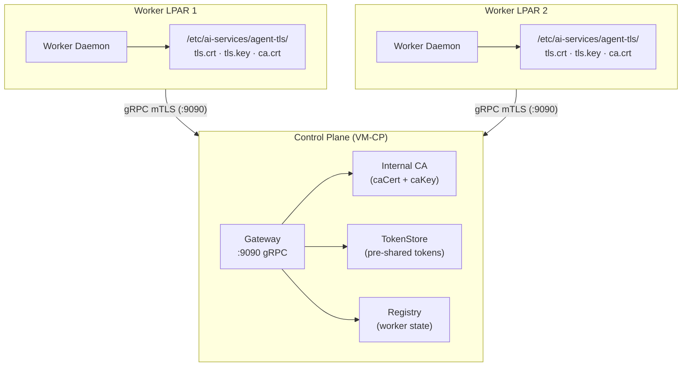
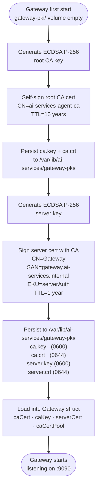
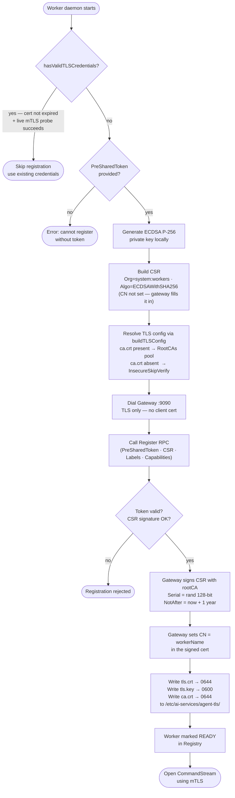
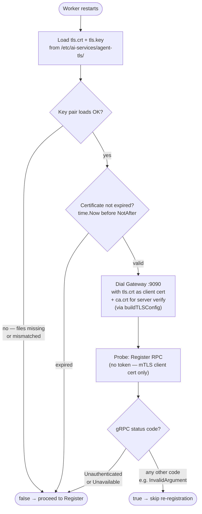

# Gateway mTLS Bootstrapping — Design Proposal

**Version:** 1.0
**Date:** September 2026
**Status:** Implemented

---

## Table of Contents

1. [Overview](#1-overview)
2. [Goals](#2-goals)
3. [Architecture](#3-architecture)
   - [3.1 Component Roles](#31-component-roles)
   - [3.2 Ports and Listeners](#32-ports-and-listeners)
   - [3.3 gRPC Service Definition](#33-grpc-service-definition)
4. [Certificate Authority and PKI](#4-certificate-authority-and-pki)
   - [4.1 Root CA](#41-root-ca)
   - [4.2 Gateway Server Certificate](#42-gateway-server-certificate)
   - [4.3 Worker Client Certificate](#43-worker-client-certificate)
   - [4.4 Control Plane PKI Bootstrap](#44-control-plane-pki-bootstrap)
5. [Worker Bootstrap — Certificate Provisioning](#5-worker-bootstrap--certificate-provisioning)
   - [5.1 Bootstrap Flow](#51-bootstrap-flow)
   - [5.2 Credential Validation on Restart](#52-credential-validation-on-restart)
6. [TLS Configuration Details](#6-tls-configuration-details)
   - [6.1 Gateway Server (Control Plane)](#61-gateway-server-control-plane)
   - [6.2 Worker Client (Worker Daemon)](#62-worker-client-worker-daemon)
7. [Hybrid TLS — Bootstrap vs mTLS Mode](#7-hybrid-tls--bootstrap-vs-mtls-mode)
8. [Key Design Decisions](#8-key-design-decisions)
9. [Security Considerations](#9-security-considerations)

---

## 1. Overview

This proposal describes how the **Gateway** (control plane) and **worker daemons** (worker LPARs) establish mutual TLS (mTLS) for all gRPC communication.

There are two distinct phases:

- **Bootstrap (first contact):** A new worker daemon has no certificate yet. It connects to the gateway using a single-use pre-shared token, submits a CSR, and receives both a CA-signed client certificate and the server's `ca.crt` in return. This first connection uses TLS (server-only) with an optional CA verification fallback.
- **Operational (post-bootstrap):** All subsequent connections — including the long-lived `CommandStream` — use strict mTLS. The gateway requires and verifies the worker's client certificate. The worker verifies the gateway's server certificate against `ca.crt`.

---

## 2. Goals

| Goal | Approach |
|---|---|
| Encrypted worker-to-gateway communication | TLS on all gRPC connections; mTLS after bootstrap |
| Authenticated workers only on `CommandStream` | Client certificate required and verified against CA pool |
| Zero pre-distributed secrets except token | Worker generates its own key locally; only a short-lived pre-shared token is distributed |
| Credential freshness on every restart | `hasValidTLSCredentials` checks expiry and probes the gateway live before skipping re-registration |
| Cert lifecycle tied to worker onboarding | Bootstrap generates ECDSA key + CSR; gateway signs and delivers the cert |
| Fail-safe token guard | Registration is rejected immediately if no valid cert exists and no token is provided |

---

## 3. Architecture

### 3.1 Component Roles



### 3.2 Ports and Listeners

| Port | Purpose | TLS Mode |
|------|---------|----------|
| `:9090` | Gateway gRPC — `Register` + `CommandStream` | Hybrid: TLS-only for `Register` (bootstrap), strict mTLS for `CommandStream` |

### 3.3 gRPC Service Definition

```protobuf
service Gateway {
  // Called once at bootstrap — TLS only (no client cert required).
  rpc Register(RegisterRequest) returns (RegisterResponse);

  // Long-lived bidirectional stream — strict mTLS required.
  rpc CommandStream(stream CommandResult) returns (stream Command);
}
```

---

## 4. Certificate Authority and PKI

The PKI is rooted in a single internal CA created once on the first gateway start. All files are persisted under `/var/lib/ai-services/gateway-pki/` and loaded into the `Gateway` at startup. Both the control-plane PKI directory and the worker TLS directory are backed by **volume mounts** (not container secrets), so individual files can be replaced on disk and picked up on the next process restart without redeploying or re-sealing any secret store.

### 4.1 Root CA

Generated once on the first gateway start when the volume path is empty and persisted on the control plane. The public `ca.crt` is returned to every worker LPAR in `RegisterResponse` so workers can verify the gateway's server certificate on all future connections.

```
/var/lib/ai-services/gateway-pki/ca.key   — CA private key  (0600, control plane only)
/var/lib/ai-services/gateway-pki/ca.crt   — CA public cert  (0644, returned to workers via RegisterResponse)
```

### 4.2 Gateway Server Certificate

Generated on the first gateway start immediately after the root CA is available. Signed by the root CA and persisted alongside it. The gateway loads it at startup and presents it to every connecting worker.

```
/var/lib/ai-services/gateway-pki/server.key  — server private key (0600)
/var/lib/ai-services/gateway-pki/server.crt  — server public cert (0644, serverAuth EKU)
```

### 4.3 Worker Client Certificate

Each worker receives a unique ECDSA P-256 certificate signed by the root CA. The certificate encodes the worker's identity:

| Field | Value |
|---|---|
| `Subject.CommonName` | Set by the gateway to the `workerName` at CSR-signing time |
| `Subject.Organization` | `system:workers` |
| `ExtKeyUsage` | `clientAuth` |
| `KeyUsage` | `DigitalSignature`, `KeyEncipherment` |
| Lifetime | 1 year (`NotAfter = now + 365d`) |
| Key algorithm | ECDSA P-256 — generated locally by the worker |

> The private key is generated on the worker LPAR and **never transmitted**. Only the CSR (public key + `Org=system:workers`) is sent to the gateway — the `Subject.CommonName` is not set by the worker; the gateway fills it in with `workerName` at signing time.

### 4.4 Control Plane PKI Bootstrap

The PKI is initialised on the **first start of the gateway** when the mounted host volume path (`/var/lib/ai-services/gateway-pki/`) is empty. If the CA files (`ca.key`, `ca.crt`) are absent, a new ECDSA P-256 root CA is generated and persisted. Similarly, if the server key and certificate (`server.key`, `server.crt`) are absent, they are generated and signed by the CA at the same time. On subsequent restarts, if all four files are already present on the volume, the generation step is skipped and the existing material is loaded directly.

The full PKI generation flow:



**Persisted files on the control plane:**

| File | Contents | Permissions |
|---|---|---|
| `/var/lib/ai-services/gateway-pki/ca.key` | Root CA private key | `0600` |
| `/var/lib/ai-services/gateway-pki/ca.crt` | Root CA public certificate | `0644` |
| `/var/lib/ai-services/gateway-pki/server.key` | Gateway server private key | `0600` |
| `/var/lib/ai-services/gateway-pki/server.crt` | Gateway server certificate (`serverAuth`) | `0644` |

---

## 5. Worker Bootstrap — Certificate Provisioning

### 5.1 Bootstrap Flow



### 5.2 Credential Validation on Restart

When the worker daemon restarts, `hasValidTLSCredentials` runs **before** any registration attempt. It performs three checks in order and returns `false` at the first failure, triggering fresh registration:



> Any non-`Unauthenticated` / non-`Unavailable` response means the mTLS handshake succeeded — the gateway accepted the client certificate. Application-layer errors (e.g. `InvalidArgument` for a missing token on the probe) are expected and treated as a passing credential check.

---

## 6. TLS Configuration Details

### 6.1 Gateway Server (Control Plane)

Configured in `Gateway.Start()`. The server uses `VerifyClientCertIfGiven` at the TLS layer to allow unauthenticated `Register` calls during bootstrap; mTLS is then enforced at the application layer by interceptors:

```go
tlsConfig := &tls.Config{
    Certificates: []tls.Certificate{g.serverCert}, // gateway's own cert
    ClientCAs:    g.caCertPool,                     // CA pool to verify worker certs
    ClientAuth:   tls.VerifyClientCertIfGiven,      // optional at TLS layer...
    // ServerName is implicitly "gateway.ai-services.internal" — encoded in SAN of server.crt
}
// ...enforced at the application layer by authStreamInterceptor
```

| RPC | TLS layer | Interceptor enforcement |
|---|---|---|
| `Register` | TLS (no client cert required) | Bypassed — pre-shared token auth instead |
| `CommandStream` | mTLS (client cert verified if present) | `authStreamInterceptor` requires a verified chain |

Worker identity is extracted from the certificate after the TLS handshake:

```go
// extractAndVerifyAgentIdentity
clientCert := tlsInfo.State.VerifiedChains[0][0]
agentID := clientCert.Subject.CommonName
```

### 6.2 Worker Client (Worker Daemon)

`buildTLSConfig(tlsDir, clientCert)` centralises all TLS config construction:

```go
// Bootstrap (no client cert yet):
buildTLSConfig(tlsDir, nil)
// → cfg.Certificates = []                          (no client cert presented)
// → cfg.ServerName   = "gateway.ai-services.internal"
// → cfg.RootCAs      = pool(ca.crt)               (or InsecureSkipVerify if ca.crt absent)

// Post-bootstrap credential check and CommandStream:
buildTLSConfig(tlsDir, &cert)
// → cfg.Certificates = []tls.Certificate{cert}    (worker presents tls.crt)
// → cfg.ServerName   = "gateway.ai-services.internal"
// → cfg.RootCAs      = pool(ca.crt)               (strict server verification)
```

Files written to `tlsDir` (`/etc/ai-services/agent-tls/`) by `writeTLSMaterial`:

| File | Contents | Permissions |
|---|---|---|
| `tls.crt` | CA-signed worker public certificate | `0644` |
| `tls.key` | Worker ECDSA private key | `0600` |
| `ca.crt` | Root CA public certificate (returned by gateway in `RegisterResponse`) | `0644` |

---

## 7. Hybrid TLS — Bootstrap vs mTLS Mode

```mermaid
sequenceDiagram
  participant AD as Worker Daemon
  participant GW as Gateway (:9090)

  Note over AD,GW: ── Phase 1: Bootstrap (first contact) ──
  AD->>GW: TLS ClientHello (no client cert)
  GW-->>AD: TLS ServerHello + serverCert
  AD->>AD: Verify serverCert against ca.crt<br/>(InsecureSkipVerify if ca.crt absent)
  AD->>GW: Register(PreSharedToken, CSR, Labels)
  GW->>GW: Validate token (TokenStore)<br/>Verify CSR signature
  GW->>GW: Sign CSR with rootCA → tls.crt<br/>Serial = rand 128-bit, TTL = 1 year
  GW-->>AD: RegisterResponse(tls.crt, ca.crt)<br/>(workerName is NOT included in the response;<br/>it is embedded as CN in the signed tls.crt)
  AD->>AD: Write tls.crt (0644)<br/>Write tls.key (0600)<br/>Write ca.crt  (0644)<br/>to /etc/ai-services/agent-tls/

  Note over AD,GW: ── Phase 2: Operational mTLS ──
  AD->>GW: mTLS ClientHello + tls.crt
  GW->>GW: Verify tls.crt against caCertPool
  GW-->>AD: mTLS ServerHello + serverCert
  AD->>AD: Verify serverCert against ca.crt
  AD->>GW: CommandStream open (bidirectional)
  GW->>GW: authStreamInterceptor:<br/>extract CN from VerifiedChains[0][0]
  GW-->>AD: stream Commands
  AD-->>GW: stream CommandResults + heartbeats
```

---

## 8. Key Design Decisions

| Decision | Rationale |
|---|---|
| Private key generated on the worker | The gateway never sees the private key; only the CSR (public material) is transmitted |
| ECDSA P-256 for worker keys | Smaller key sizes, faster handshakes vs RSA; adequate for 1-year cert lifetime |
| `VerifyClientCertIfGiven` at TLS layer | Allows unauthenticated `Register` without a separate port or listener |
| Application-layer interceptors enforce mTLS | Interceptors gate `CommandStream` independently of the TLS layer setting, providing defence-in-depth |
| `hasValidTLSCredentials` probes gateway live | Catches revoked certs, CA rotation, and connectivity loss before skipping re-registration |
| Token guard before key generation | Fail-fast if there's no valid cert and no token — avoids generating an unusable key pair |
| Single CA signs both server and worker certs | Simplifies trust model — one root to distribute, no intermediate CAs required |
| PKI persisted under `gateway-pki/` | Survives process restarts without regeneration; loaded at startup if all four files are present |

---

## 9. Security Considerations

- **Root CA private key** (`caKey`) is generated once and stored in a persistent, access-controlled location on the control plane's disk. It is loaded into the gateway process at startup and is never transmitted over the wire. It must never be distributed to worker LPARs.
- **Pre-shared token** is single-use. `TokenStore.Validate` consumes it on first use, preventing replay attacks.
- **CSR subject**: The worker does **not** set a `Subject.CommonName` in the CSR. The gateway fills in `CN = workerName` during the signing process. Worker identity on the gateway side is derived from `VerifiedChains[0][0].Subject.CommonName` after the mTLS handshake, not from any application-layer name claim in the request.
- **Worker private key** is generated locally on the worker LPAR by the worker daemon itself, stored at `/etc/ai-services/agent-tls/tls.key` with `0600` permissions, and never included in any RPC payload — only the public CSR is transmitted to the gateway.
- **`InsecureSkipVerify` fallback** is limited exclusively to the initial bootstrap `Register` call, and only when `ca.crt` is not yet present on the worker. Once registration completes, the gateway returns the server's `ca.crt` alongside the signed `tls.crt` in `RegisterResponse`; the worker writes it to `/etc/ai-services/agent-tls/ca.crt` and all subsequent connections use it for strict server verification. If `ca.crt` is provisioned on the worker before bootstrap (e.g. delivered alongside the pre-shared token during operator onboarding), the `InsecureSkipVerify` fallback is never triggered and the entire lifecycle — including the first `Register` call — operates in a fully trusted environment.
- **Server SAN and `ServerName`**: The gateway server certificate carries the fixed SAN `gateway.ai-services.internal`. Every worker daemon sets `cfg.ServerName = "gateway.ai-services.internal"` in its TLS configuration so that Go's TLS stack validates the presented server certificate against this exact name — regardless of the IP address or hostname used to dial the gateway.
- **`workerName` in the signed certificate**: At CSR-signing time the gateway sets the certificate's `Subject.CommonName` to the `workerName`. This name is **not** transmitted separately in `RegisterResponse`; only the signed `tls.crt` and the `ca.crt` are returned. The worker already knows its own name, and the gateway derives worker identity post-handshake from `VerifiedChains[0][0].Subject.CommonName`.
- **Certificate lifetime** is 1 year. `hasValidTLSCredentials` rejects expired certs at daemon restart, triggering re-registration with a fresh token before the worker reconnects.
- **`CommandStream` identity** is cryptographically derived from the verified TLS chain (`VerifiedChains[0][0].Subject.CommonName`), not from any application-layer claim in the message payload — preventing identity spoofing by a compromised worker.
- **10-second timeout** on the `hasValidTLSCredentials` probe prevents a stalled gateway from blocking worker startup indefinitely.
- **Volume-mount storage for keys and certs** — all TLS material on both the control plane (`/var/lib/ai-services/gateway-pki/`) and worker LPARs (`/etc/ai-services/agent-tls/`) is stored as plain files on volume mounts rather than in a container secret store. This intentional choice simplifies the rotation process: replacing a certificate or key is a file-write-and-restart operation, with no secret re-sealing, no redeployment, and no secret-store API calls required.
